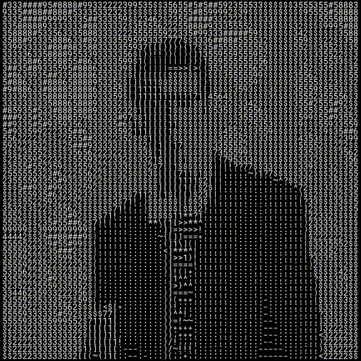

# မင်္ဂလာပါ ကမ္ဘာလောက! This is [Jagadeesh](https://mummanajagadeesh.github.io/). <!-- updated: 2026-05-01 05:00:10 IST -->

<!--# こんにちは、世界！これは [Jagadeesh](https://mummanajagadeesh.github.io/) です。-->

  <!-- Portfolio -->
  
  

  <!-- Blog -->
  
  

  <!-- LinkedIn -->
  
  

  <!-- Instagram -->
  
  

  <!-- Discord -->
  
  

  <!-- GitHub -->
  
  

  <!-- Email -->
  
  

  <!-- Facebook -->
  <!--
  
  
  -->

  <!-- X (Twitter) -->
  <!--
  
  
  -->

  <!-- Reddit -->
  
  

  <!-- Old Site -->
  
  

  <!-- YouTube -->
  
  

  <!-- Cube -->
  
  

  <!-- Duolingo -->
  
  

  <!-- Play Games -->
  
  

<!-- <h1 align="left">
  +just_another_student;$+echo+%22future+plans%22;>+Take+AI's+Job+:P;$+ping+reality;>+Request+timed+out;$+ls+/life;>+Nothing+interesting+yet;$+cat+motivation.txt;>+motivation.txt+->+empty;$+top+-n+1;>+CPU:+99%25+brain+usage;$+git+commit+-m+%22life_changes%22;>+nothing+to+commit,+working+tree+clean;$+./run_robot.sh;>+Battery+not+included;$+sudo+rm+-rf+/stress;>+Permission+denied" 
    alt="$ whoami -> just_another_student; echo 'future plans' -> Take AI's Job :P; ping reality -> Request timed out; ls /life -> Nothing interesting yet; cat motivation.txt -> motivation.txt -> empty; top -n 1 -> CPU: 99% brain usage; git commit -m 'life_changes' -> nothing to commit, working tree clean; ./run_robot.sh -> Battery not included; sudo rm -rf /stress -> Permission denied" 
  />
</h1> -->

<table border="0" cellspacing="0" cellpadding="0">
  <tr>
    <td>

<pre><strong>$ less ~/workspace/profile/config.yaml</strong>

  <strong>FOCUS:</strong>      "learning so slow my <a href="https://mummanajagadeesh.github.io/blogs"><strong>blog</strong></a> can’t keep up"
  <strong>KNOWS:</strong>      "anything bw sand nd the entity thinking back at us rn"<!-- <strong>ASKME:</strong>         "stuff i know, or stuff i can google before u blink" -->
  <strong>BUILDING:</strong>   "<em>hw accel arch for img classif<em>; it can sǝǝ john cena</em>"
  <strong>CLUB:</strong>       "feeding robots my gpa @<a href="https://rignitc.com"><strong>rignitc</strong></a>"
  <strong>COMPS:</strong>      ["e-yantra MB", "openpower hw"]
  <strong>MAJOR:</strong>      "<em>electronics nd communication engg</em>"
  <strong>COLLEGE:</strong>    "<em>national institute of technology calicut</em>"
  <strong>CONTACT:</strong>    "<a href="https://mummanajagadeesh.github.io/contact"><strong>carrier pigeons :p</strong></a>"
  <strong>HOBBIES:</strong>    ["speedcubing", "movies", "4k day dreaming"]
  <strong>FUNFACT:</strong>    "i'm batman"
  <strong>SECRET:</strong>     "i pay the moon to follow me around"
  <strong>WHATIF:</strong>     "if i eat myself, do I become twice as big or disappear?"
</pre>

  </td>
  <td>
    
  </td>
  </tr>
</table>

<!--<code>module about_me;</code> 

<code>    parameter FOCUS     = "Always learning - check out my <a href="https://mummanajagadeesh.github.io/blogs"><strong>blog</strong></a>",</code> 
<code>              CURRENTLY = "Building a HW accelerator arch for IMG CLASSIF",</code> 
<code>              CLUB      = "Rigging robots @<a href="https://mummanajagadeesh.github.io/RIGNITC"><strong>RIGNITC</strong></a>",</code> 
<code>              MAJOR     = "<em>Electronics and Communication Engg</em>",</code> 
<code>              COLLEGE   = "<em>National Institute of Technology Calicut</em>",</code> 
<code>              CONTACT   = "<a href="https://mummanajagadeesh.github.io/contact"><strong>Carrier Pigeons :P</strong></a>",</code> 
<code>              PRONOUNS  = "he/him",</code> 
<code>              HOBBIES   = "Speedcubing, Movies, Blogging",</code> 
<code>              FUN_FACT  = "I'm Batman";</code> 

<code>endmodule</code> -->

  <picture>
    <source srcset="dist/github-snake-dark.svg" media="(prefers-color-scheme: dark)">
    
  </picture>

  

# `$ whoami -v`

<table width="100%">
<tr>
<td>

<pre>
⣿⣿⣿⣿⣿⣿⣿⣿⣿⣿⡿⠿⠿⠿⠿⠿⢿⣿⣿⣿⣿⣿⣿⣿⣿⣿ 
⣿⠩⡆⠐⣹⣿⣿⣿⣿⠋⠀⢀⡀⠀⠀⠀⠀⠀⠉⠙⢿⣿⣿⣿⣿⣿
⣿⣶⡔⠷⠝⣿⣿⣛⠁⠭⢭⡻⣿⣆⢀⠟⠁⠀⠀⠀⠀⢻⣿⣿⣿⣿
⣿⠟⣣⣶⣿⣿⣿⠁⣴⣶⡄⠹⣽⣿⠋⠠⢔⣾⡇⠀⠀⠀⢿⣿⣿⣿
⡟⣾⣿⣿⣿⣿⣿⣄⠙⠛⢁⣼⣿⠁⣴⣦⡀⢁⣿⣶⣤⠀⢸⣿⣿⣿
⡇⣿⣿⣿⡿⣛⣛⠿⣿⣿⣿⣿⣿⣄⠙⠛⢁⣼⣿⣿⡟⠀⢸⣿⣿⣿
⣿⢹⣿⢧⣾⣿⣿⣿⡜⣿⣿⣿⣿⣿⣿⣿⣿⣿⣿⣿⠁⢀⡸⢿⣿⣿
⣿⣷⣝⠞⢿⣿⣿⣿⢣⣿⣿⣿⣿⣿⣿⣿⣿⣿⣿⣿⣾⣿⣿⣧⢿⣿
⣿⣿⣿⢰⣤⡉⣉⠾⠿⠿⠿⠿⠿⣿⣿⣿⣿⣿⠟⣿⣿⣿⣿⠏⣾⣿
⣿⣿⣿⢸⣿⣿⣩⠺⣶⣝⣛⣛⣛⣯⢤⣶⡰⢖⣴⣝⣛⢛⣫⣾⣿⣿
⣿⣿⢧⣿⣿⣿⣟⣀⣿⣿⣿⣿⣿⣿⡇⢿⣿⣯⡻⣿⣿⣏⢿⣿⣿⣿
⣿⣿⣼⣿⣿⣿⡃⣼⣿⣿⣿⣿⣿⣿⣇⠸⣿⣿⣷⡉⡻⣿⣷⣝⢿⣿
⣿⣿⡻⣿⣿⡯⢹⣿⣿⣿⣿⣿⣿⣿⣿⢀⣿⣿⣿⣇⣿⣯⡛⡥⣶⡎
⣿⣿⣿⣾⠉⡳⡌⠿⢿⣿⣿⣟⣻⣿⡿⣸⣿⣿⣿⠿⣎⣿⣷⣦⣭⣾
⣿⣿⣿⣧⡚⡳⢤⣞⣻⣿⡿⣛⢯⣭⣃⠩⣭⣤⣆⣾⣿⣿⣿⣿⣿⣿
⣿⣿⣿⣏⠔⢛⣂⣠⣽⢋⣾⣿⣧⣻⣷⣭⣳⣭⡟⣿⣿⣿⣿⣿⣿⣿
⣿⣿⣿⣿⣿⣎⢛⡿⢟⣼⣿⣿⣿⣷⡽⣿⡿⠿⢧⣿⣿⣿⣿⣿⣿⣿
⣿⣿⣿⣿⣿⣿⡼⣿⢸⣿⣿⣿⣿⣿⣿⣇⢶⡏⢿⣿⣿⣿⣿⣿⣿⣿
⣿⣿⣿⡿⠟⣋⢴⣶⡟⣿⣿⣿⣿⣿⣿⣿⠨⠁⠐⠌⢻⣿⣿⣿⣿⣿
⣿⣿⣿⣔⣚⣿⣿⣯⣵⣿⣿⣿⣿⣿⣿⣿⣷⣥⣄⣠⣼⣿⣿⣿⣿⣿
</pre>

</td>
<td>

<pre>
hey, i'm Jagadeesh

i work mainly on digital/analog 
  hw design: RTL, ckt-lvl & basic arch
learning open-source IC flows; 
  building/testing small HW blocks
i also work with MCU/SBCs in basic 
  sys-design for robotics/rototyping
active in comps, open-source, 
  hw/sw co-design challenges

MY key interests:     
 - analog and digital circuit design
 - rtl verification, debugging, and validation
 - compute and signal processing systems
 - amplifiers, oscillators, and control
 - hardware architecture and u-arch
 - robotics and computer vision

feel free to check out 
├  my <a href="https://mummanajagadeesh.github.io/projects/"><strong>Projects</strong></a> above, 
├─nd if you’re interested in 
├  collaborating/discussing HW/ML/robotics, 
└─let’s connect :)
</pre>

</td>
</tr>
</table>

<!--<pre>
  
Hey, I'm Jagadeesh - I work across VLSI design, robotics, and AI hardware.
I’m particularly interested in digital and analog VLSI, hardware acceleration for machine learning and image processing,
and the practical side of taking designs from code to silicon.
Alongside this, I enjoy programming embedded systems, working with microcontrollers, and building robotics applications.
I also enjoy collaborating in competitions, open-source projects, and hands-on hardware/software design challenges.

  
MY Key Interests:                                                           What I Do:
- VLSI Design: Analog & Digital                                             - I’m a student (yes, I copy assignments)  
- Neural Nets & Image Processing                                            - But serious with projects & builds 
- Embedded Programming (C, C++, Python)                                     - Do a bit of digital & analog design on the side
- Microcontrollers & Electronics                                            - Train models sometimes   
- Computer Vision, Sensor Fusion                                            - Member of RIGNITC (we make robots)
- Robotics, Path Planning & Navigation                                      - Show up at hw comps (sw depends on mood)

  
Feel free to check out my projects [here](https://mummanajagadeesh.github.io/projects/), 
and if you’re interested in collaborating or discussing hardware, AI, or robotics, let’s connect!
  
</pre>-->

# `$ git stats --all`

<!--

<!-- LIGHT MODE -->

  <!--
  -->

<!-- DARK MODE -->

  <!--
  -->

<!-- LIGHT MODE -->

  

  

  

<!-- DARK MODE -->

  

  

  

# `$ sudo wisdom`

<!-- Light Mode Quote -->

  

<!-- Dark Mode Quote -->

  

