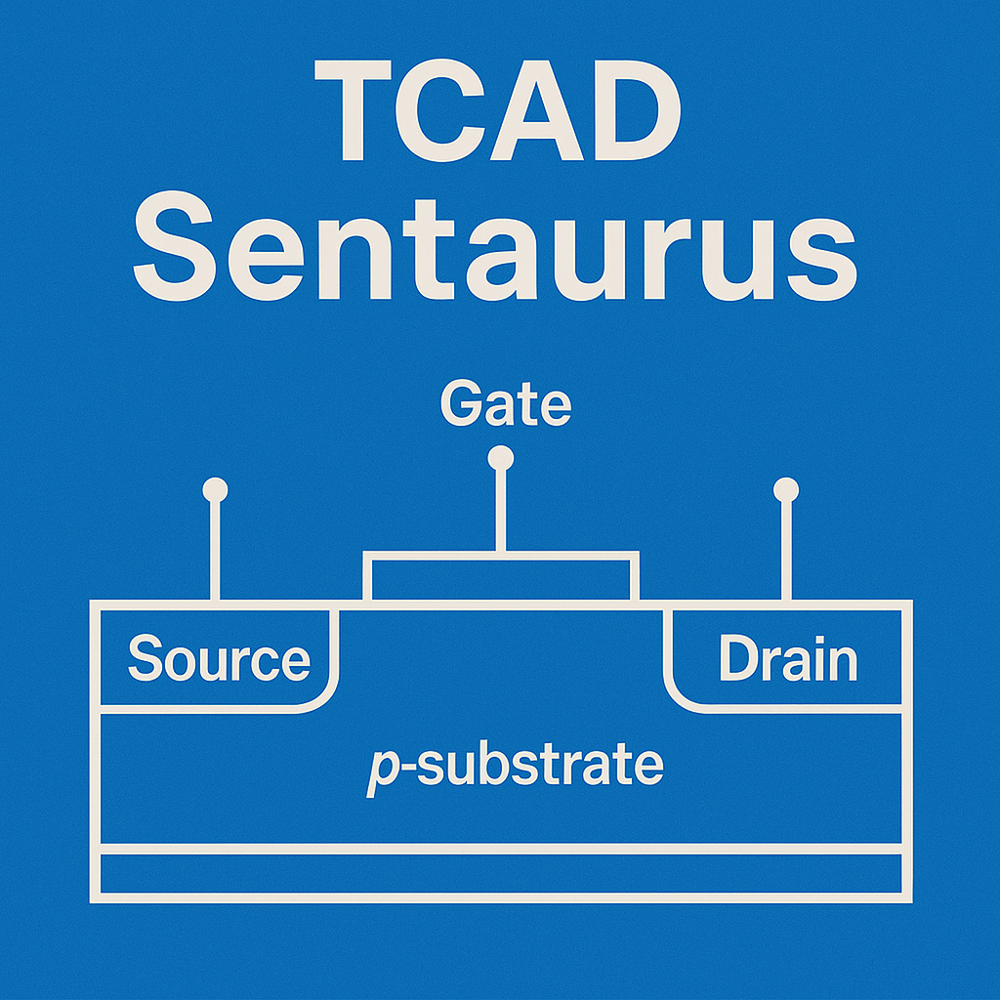

# 你好，世界！This is [Jagadeesh](https://mummanajagadeesh.github.io/). <!-- updated: 2026-01-21 22:40:46 IST -->

<!--# こんにちは、世界！これは [Jagadeesh](https://mummanajagadeesh.github.io/) です。-->


<p align="left">
  <!-- Portfolio -->
  <a href="https://mummanajagadeesh.github.io/#gh-light-mode-only">
    
  </a>
  <a href="https://mummanajagadeesh.github.io/#gh-dark-mode-only">
    
  </a>

  <!-- Blog -->
  <a href="https://mummanajagadeesh.github.io/blog/all#gh-light-mode-only">
    
  </a>
  <a href="https://mummanajagadeesh.github.io/blog/all#gh-dark-mode-only">
    
  </a>

  <!-- LinkedIn -->
  <a href="https://www.linkedin.com/in/jagadeeesh-mummana#gh-light-mode-only">
    
  </a>
  <a href="https://www.linkedin.com/in/jagadeeesh-mummana#gh-dark-mode-only">
    
  </a>

  <!-- Instagram -->
  <a href="https://www.instagram.com/jagadeesh__97__#gh-light-mode-only">
    
  </a>
  <a href="https://www.instagram.com/jagadeesh__97__#gh-dark-mode-only">
    
  </a>

  <!-- Discord -->
  <a href="https://discord.com/users/864753029030215690#gh-light-mode-only">
    
  </a>
  <a href="https://discord.com/users/864753029030215690#gh-dark-mode-only">
    
  </a>

  <!-- GitHub -->
  <a href="https://github.com/Mummanajagadeesh#gh-light-mode-only">
    
  </a>
  <a href="https://github.com/Mummanajagadeesh#gh-dark-mode-only">
    
  </a>

  <!-- Email -->
  <a href="mailto:mummanajagadeesh97@gmail.com#gh-light-mode-only">
    
  </a>
  <a href="mailto:mummanajagadeesh97@gmail.com#gh-dark-mode-only">
    
  </a>

  <!-- Facebook -->
  <!--
  <a href="https://www.facebook.com/MJagadeesh97/#gh-light-mode-only">
    
  </a>
  <a href="https://www.facebook.com/MJagadeesh97/#gh-dark-mode-only">
    
  </a>
  -->

  <!-- X (Twitter) -->
  <!--
  <a href="https://x.com/M_JAGADEESH97#gh-light-mode-only">
    
  </a>
  <a href="https://x.com/M_JAGADEESH97#gh-dark-mode-only">
    
  </a>
  -->


  <!-- Reddit -->
  <a href="https://www.reddit.com/user/Large-Raisin-5912/#gh-light-mode-only">
    
  </a>
  <a href="https://www.reddit.com/user/Large-Raisin-5912/#gh-dark-mode-only">
    
  </a>

  <!-- Old Site -->
  <a href="https://jagadeesh-mummana.vercel.app/#gh-light-mode-only">
    
  </a>
  <a href="https://jagadeesh-mummana.vercel.app/#gh-dark-mode-only">
    
  </a>

  <!-- YouTube -->
  <a href="https://www.youtube.com/@M_J_9_7#gh-light-mode-only">
    
  </a>
  <a href="https://www.youtube.com/@M_J_9_7#gh-dark-mode-only">
    
  </a>

  <!-- Cube -->
  <a href="https://events.cubelelo.com/profile/24CLMUM001#gh-light-mode-only">
    
  </a>
  <a href="https://events.cubelelo.com/profile/24CLMUM001#gh-dark-mode-only">
    
  </a>

  <!-- Duolingo -->
  <a href="https://www.duolingo.com/profile/jagadeesh97#gh-light-mode-only">
    
  </a>
  <a href="https://www.duolingo.com/profile/jagadeesh97#gh-dark-mode-only">
    
  </a>

  <!-- Play Games -->
  <a href="https://games.app.goo.gl/p1bNrgGSnMbK4hte9#gh-light-mode-only">
    
  </a>
  <a href="https://games.app.goo.gl/p1bNrgGSnMbK4hte9#gh-dark-mode-only">
    
  </a>
</p>


<!-- <h1 align="left">
  +just_another_student;$+echo+%22future+plans%22;>+Take+AI's+Job+:P;$+ping+reality;>+Request+timed+out;$+ls+/life;>+Nothing+interesting+yet;$+cat+motivation.txt;>+motivation.txt+->+empty;$+top+-n+1;>+CPU:+99%25+brain+usage;$+git+commit+-m+%22life_changes%22;>+nothing+to+commit,+working+tree+clean;$+./run_robot.sh;>+Battery+not+included;$+sudo+rm+-rf+/stress;>+Permission+denied" 
    alt="$ whoami -> just_another_student; echo 'future plans' -> Take AI's Job :P; ping reality -> Request timed out; ls /life -> Nothing interesting yet; cat motivation.txt -> motivation.txt -> empty; top -n 1 -> CPU: 99% brain usage; git commit -m 'life_changes' -> nothing to commit, working tree clean; ./run_robot.sh -> Battery not included; sudo rm -rf /stress -> Permission denied" 
  />
</h1> -->


<table border="0" cellspacing="0" cellpadding="0">
  <tr>
    <td>

<pre><strong>$ less ~/workspace/profile/config.yaml</strong>

  <strong>FOCUS:</strong>         "learning so slow my <a href="https://mummanajagadeesh.github.io/blog/all"><strong>blog</strong></a> can’t keep up"
  <strong>KNOWS:</strong>         "anything bw sand nd the entity thinking back at us rn"<!-- <strong>ASKME:</strong>         "stuff i know, or stuff i can google before u blink" -->
  <strong>BUILDING:</strong>      "<em>hw accel arch for img classif<em>; it can sǝǝ john cena</em>"
  <strong>CLUB:</strong>          "feeding robots my gpa @<a href="https://rignitc.com"><strong>rignitc</strong></a>"
  <strong>COMPS:</strong>         ["e-yantra MB", "openpower hw"]
  <strong>MAJOR:</strong>         "<em>electronics nd communication engg</em>"
  <strong>COLLEGE:</strong>       "<em>national institute of technology calicut</em>"
  <strong>CONTACT:</strong>       "<a href="https://mummanajagadeesh.github.io/contact"><strong>carrier pigeons :p</strong></a>"
  <strong>HOBBIES:</strong>       ["speedcubing", "movies", "4k day dreaming"]
  <strong>FUNFACT:</strong>       "i'm discount batman"
  <strong>SECRET:</strong>        "i pay the moon to follow me around"
  <strong>WHATIF:</strong>        "if i eat myself, do I become twice as big or disappear?"
</pre>

  </td>
  <td>
    
  </td>
  </tr>
</table>


<!--<code>module about_me;</code><br>

<code>    parameter FOCUS     = "Always learning - check out my <a href="https://mummanajagadeesh.github.io/blog/all"><strong>blog</strong></a>",</code><br>
<code>              CURRENTLY = "Building a HW accelerator arch for IMG CLASSIF",</code><br>
<code>              CLUB      = "Rigging robots @<a href="https://mummanajagadeesh.github.io/RIGNITC"><strong>RIGNITC</strong></a>",</code><br>
<code>              MAJOR     = "<em>Electronics and Communication Engg</em>",</code><br>
<code>              COLLEGE   = "<em>National Institute of Technology Calicut</em>",</code><br>
<code>              CONTACT   = "<a href="https://mummanajagadeesh.github.io/contact"><strong>Carrier Pigeons :P</strong></a>",</code><br>
<code>              PRONOUNS  = "he/him",</code><br>
<code>              HOBBIES   = "Speedcubing, Movies, Blogging",</code><br>
<code>              FUN_FACT  = "I'm Batman";</code><br>

<code>endmodule</code><br>-->


<div align="center">
  <picture>
    <source srcset="dist/github-snake-dark.svg" media="(prefers-color-scheme: dark)">
    
  </picture>
</div>


<br><br>


# `$ ls ~/projects -filter=feat`

<em>(Click sections below to expand)</em>


</details>

<details>
  <summary><b>Digital/Physical Design/Verfication & Compute Architectures</b></summary>
<br>

  
<details>
<summary>
  <strong>
    INT8 Fixed-Point CNN Hardware Accelerator and Image-Processing Suite |
    <a href="https://mummanajagadeesh.github.io/projects/vision/subprojects" target="_blank">Link</a>
  </strong>
</summary>
<br>

**Design of High-Performance Q1.7 Fixed-Point Quantized CNN Hardware Accelerator with Microarchitecture Optimization of 3-Stage Pipelined Systolic MAC Arrays for Lightweight Inference**

A fully synthesizable INT8 CNN accelerator for CIFAR-10, built around a 3-stage pipelined systolic-array MAC microarchitecture optimized from a 6-design PPA benchmark.
Includes complete quantization workflow (PTQ/QAT), 2-cycle ready/valid protocol, ROM automation, FP32↔RTL accuracy checks, and a hardware image-processing suite
  
> **" I tried to ImProVe, but NeVer really did - so I MOVe-d on ¯\\\_(ツ)_/¯ "**<br>
<!--
> **" ¯\\\_(ツ)_/¯ Read the above in RTL mode to decode the other 2/4 "**
-->

**Current Project Overview**

**Duration:** Individual, Ongoing  
**Tools:** Verilog (Icarus Verilog, Yosys) | Python (TensorFlow, NumPy) | Scripting (TCL, Perl)

---

### **8-bit Quantized CNN Hardware Accelerator: Open-source, Modular, & Optimized for Inference**

**[Project Link](https://mummanajagadeesh.github.io/projects/vision/subprojects/)**
*Verilog | Basic Architecture | Digital Electronics*


* Designed a fully synthesizable **shallow Res-CNN** for CIFAR-10, evaluated against eight reference CNNs, and achieved a **Pareto-optimal trade-off** across throughput, latency, and accuracy.

* Implemented **systolic-array processing elements** using 8-bit CSA–MBE MAC units with FSM-driven control logic and a **2-cycle read/valid handshake**.
  Verified end-to-end datapath behavior through structured testbenches.

* Performed detailed **post-training quantization (PTQ)** and **quantization-aware training (QAT)** studies.
  Quantizing from Q1.31 to Q1.3 allowed exploration of precision vs. accuracy trends, and a **Q1.7 PTQ model retained ~84% accuracy** (less than 1% drop) while reducing the model memory footprint by **4× (≈52 kB)**.

* Developed automated scripts (TCL + Python) to **generate 14 coefficient ROMs and 3 RGB input ROMs**, enabling seamless hardware ingestion of model parameters and images.
  Verified **TensorFlow / FP32 ↔ RTL output consistency** and automated full-pipeline inference execution.

* Built a compact **digital image-processing toolkit** (edge detection, denoising, filtering, enhancement) and an **MLP classifier** for (E)MNIST datasets.
  Achieved **>75% accuracy** with real-time GUI visualization for interactive experimentation.


---

<details>
  <summary>
  <b>Technical Summary</b>
  </summary>

- Designed a fully synthesizable INT8 CNN accelerator (Q1.7 PTQ) for CIFAR-10, optimized for throughput, latency determinism, and precision efficiency. Implemented a 2-cycle ready/valid handshake for all inter-module transactions and FSM-based control sequencing for deterministic pipeline timing. Trained 8 CNNs (TensorFlow, identical augmentation & LR scheduling w/ vanilla Adam optimizer) and performed architecture-level DSE via Pareto analysis, selecting 2 optimal variants including a ResNet-style residual CNN.

- PTQ/QAT comparisons were conducted across Q1.31, Q1.15, Q1.7, and Q1.3; Q1.7 PTQ (1-int, 7-frac | 0.0078 step) gave the best accuracy–memory trade-off { Q1.31 ~84% ~210kB | Q1.7 ~83% ~52kB | Q1.3 ~78% ~26kB }, achieving ~84% top-1 accuracy, <1% loss, and ≈52 KB total (≈17×3 KB RGB inputs)
  
- The 3-stage pipelined systolic-array convolution core employs Processing Elements (PEs) built around MAC units composed of 8-bit signed Carry-Save Adders (CSA) and Modified Booth-Encoded (MBE) multipliers, arranged in a 2D grid for high spatial reuse and single-cycle accumulation. All 14 coefficient ROMs and 3 RGB input ROMs were auto-generated via a Python/TCL automation flow handling coefficient quantization, packing, and open-source EDA simulation. Verified bit-accurate correlation between TensorFlow FP32 and RTL fixed-point inference layer-wise; an IEEE-754 single-precision CNN variant validated numeric consistency.

- Integrated image-processing modules (edge detection, denoising, filtering, contrast enhancement) form a Verilog-based hardware preprocessing pipeline, feeding an MLP classifier evaluated on the (E)MNIST (52+)10 ByClass datasets. The MLP shares the preprocessing and automation flow, with an additional IEEE-754 64-bit FP variant for precision benchmarking. A Tkinter GUI enables interactive character input, and preprocessing visualization via Matplotlib


</details>

---

### **High-Speed 3-Stage Pipelined Systolic Array-Based MAC Architectures**
*Digital Logic Design | Synthesis*


* Benchmarked **six different 8-bit signed adder–multiplier architectures** using PPA metrics (latency, throughput, and area) on the Sky130 PDK, and analyzed their architectural trade-offs in the context of low-power convolution workloads.

* Designed a **3-stage pipelined systolic MAC** based on a CSA–MBE multiplier structure, achieving substantial improvements over a naïve conv3 baseline:
  **66.3% lower delay**, **3.1× higher area efficiency**, and **82.2% lower typical power**.

* Implemented a **2D systolic PE-grid** supporting general convolution and GEMM operations, with verified behavior under zero-padding and same-padding configurations.
  GEMM optimization reduced power consumption by **44.6%** for matrix dimension (N = 3).

* Integrated a **648-bit scan chain** spanning all pipeline and control registers, enabling full DFT/ATPG support with only **14.5% cell-area overhead**, ensuring manufacturability and high test coverage.


---

<details>
  <summary>
  <b>Technical Summary</b>
  </summary>
  
- Benchmarked six 8-bit signed adder and multiplier architectures for systolic-array MACs targeting CNN/GEMM workloads using a fully open-source ASIC flow (Yosys + OpenROAD/OpenLane) on the Google-SkyWater 130nm PDK (Sky130HS PDK @25°C_1.8V). Evaluated PPA (Power, Performance, Area) and latency/throughput/area metrics under a constant synthesis and layout environment with fixed constraints and floorplan parameters (FP_CORE_UTIL = 30 %, PL_TARGET_DENSITY = 0.36, 10 ns clock, CTS/LVS/DRC/Antenna enabled)

- Adders:
  - CSA – 5.07 ns CP, 197 MHz Fmax, 2.52 k µm² core, 0.083 mW (best speed/resource trade-off)
  - Kogge–Stone – 6.21 ns, 161 MHz, 3.69 k µm² (area-heavy)
  - RCA – 7.14 ns, 140 MHz, 1.13 k µm², 0.032 mW (most power/area-efficient)

- Multipliers:
  - MBE – 8.84 ns, 113 MHz, 9.6 k µm², 0.379 mW (best energy/area efficiency = 3.35 × 10³ pJ/op, 8.64 × 10³ ops/s/µm²)
  - Baugh–Wooley – 8.63 ns, 115.9 MHz (fastest)
  - Booth (Radix-2) – 12.5 ns, 80 MHz (highest area/power)

- Final MAC integrates an 8-bit signed CSA adder and 8-bit signed MBE multiplier in a 3×3 convolution/GEMM core using a 3-stage pipelined systolic array (sampling → truncation/flipping → MAC accumulation). Verified via RTL testbench and post-synthesis timing across zero/same-padding modes. Automated GDS/DEF generation and PPA reporting for all architectures ensured fully reproducible, environment-consistent results

- Comparative study (Small Scale Ops) :

  - CSA-MBE pair Systolic Array Conv vs Naïve Conv (3x3 Kernel on 5x5 Image @CLK_PERIOD_20_ns) 
    - Latency ↓ 66.3% Throughput ↑ 196.6% Speed ↑ 196.6% Area ↓ 67.8% Power ↓ 82.2%

  - Single MAC re-use vs Systolic 4-PE Grid (2x2 matrix multiplication)
    - Latency ↓ 0.9% Throughput ≈ same Speed ≈ same Area ≈ same Power ↓ 15% Energy/op ↓ 14.6%
      
  - Single MAC re-use vs Systolic 9-PE Grid (3x3 matrix multiplication)
    - Latency ↓ 1% Throughput ≈ same Speed ≈ same Area ≈ same Power ↓ 44.6% Energy/op ↓ 44%

### **DFT (Scan Chain) Add-On**

* Integrated a **648-bit full-scan chain** across all pipeline, control, and output registers in the 3×3 systolic MAC/convolution datapath.
  Every state element is replaced with a single-bit scan DFF (SE/SI/SO), enabling serial load/unload of internal state.

* Flattened register groups (kernel flip buffer, px16/px8 slices, ker8 slices, prod_s2 pipeline, row/col counters, valid pipe, output registers, done flag) into one contiguous chain, ensuring deterministic bit ordering and simple scan stitching.

* Verified scan behavior through shift–capture–shift TB patterns and ensured functional transparency:
  scan mode (`SE=1`) freezes datapath updates, while normal mode (`SE=0`) preserves original functionality.

* Total overhead from scan insertion is ~14.5% in standard cells, with no change to functional timing or systolic pipeline throughput at the target clock.


</details>  

---

<details>
  <summary>
  <b>Repositories</b>
  </summary>

<p align="center">
  
<a href="https://github.com/Mummanajagadeesh/ViSiON#gh-light-mode-only">
  
</a>
<a href="https://github.com/Mummanajagadeesh/ViSiON#gh-dark-mode-only">
  
</a>
</p>
<p align="center"><strong>ViSiON</strong> – <strong><em>V</em></strong>erilog for <strong><em>I</em></strong>mage Processing and <strong><em>S</em></strong>imulation-based <strong><em>I</em></strong>nference <strong><em>O</em></strong>f <strong><em>N</em></strong>eural Networks</p>
<p align="center">This repo includes all related projects as submodules in one place</p>


<br><br>

---

<!-- Image Cards Table -->
<table>
  <tr>
    <td align="center">
      <a href="https://github.com/Mummanajagadeesh/ImProVe#gh-light-mode-only">
        
      </a>
      <a href="https://github.com/Mummanajagadeesh/ImProVe#gh-dark-mode-only">
        
      </a>
    </td>
    <td align="center">
      <a href="https://github.com/Mummanajagadeesh/NeVer#gh-light-mode-only">
        
      </a>
      <a href="https://github.com/Mummanajagadeesh/NeVer#gh-dark-mode-only">
        
      </a>
    </td>
  </tr>
</table>

<!-- Descriptions below -->
<br>

<p><strong>ImProVe</strong> – <strong><em>IM</em></strong>age <strong><em>PRO</em></strong>cessing using <strong><em>VE</em></strong>rilog: A collection of image processing algorithms implemented in Verilog, including geometric transformations, color space conversions, and other foundational operations.</p>

<p><strong>NeVer</strong> – <strong><em>NE</em></strong>ural <strong><em>NE</em></strong>twork on <strong><em>VER</em></strong>ilog: A hardware-implemented MLP in Verilog for character recognition on (E)MNIST, alongside a lightweight CNN for CIFAR-10 image classification</p>

<br>

<p><strong>MOVe</strong> – <strong><em>M</em></strong>ath <strong><em>O</em></strong>ps in <strong><em>VE</em></strong>rilog</p>


<!-- Image Cards Table -->
<table>
  <tr>
    <td align="center">
      <a href="https://github.com/Mummanajagadeesh/cordic-algorithm-verilog#gh-light-mode-only">
        
      </a>
      <a href="https://github.com/Mummanajagadeesh/cordic-algorithm-verilog#gh-dark-mode-only">
        
      </a>
    </td>
    <td align="center">
      <a href="https://github.com/Mummanajagadeesh/systolic-array-matrix-multiplication#gh-light-mode-only">
        
      </a>
      <a href="https://github.com/Mummanajagadeesh/systolic-array-matrix-multiplication#gh-dark-mode-only">
        
      </a>
    </td>
  </tr>
</table>

<table>
  <tr>
    <td align="center">
      <a href="https://github.com/Mummanajagadeesh/hw-multiply-and-accumulate-units-verilog#gh-light-mode-only">
        
      </a>
      <a href="https://github.com/Mummanajagadeesh/hw-multiply-and-accumulate-units-verilog#gh-dark-mode-only">
        
      </a>
    </td>
    <td align="center">
      <a href="https://github.com/Mummanajagadeesh/alternate-numerical-notations-for-riscv#gh-light-mode-only">
        
      </a>
      <a href="https://github.com/Mummanajagadeesh/alternate-numerical-notations-for-riscv#gh-dark-mode-only">
        
      </a>
    </td>
  </tr>
</table>

<br>

<!-- Descriptions as bullet points -->
<br>

<ul>
  <li>
    <p><strong>CORDIC Algorithm</strong> – Implements Coordinate Rotation Digital Computer (CORDIC) algorithms in Verilog for efficient hardware-based calculation of sine, cosine, tangent, square root, magnitude, and more.</p>
  </li>
  <li>
    <p><strong>Systolic Array Matrix Multiplication</strong> – Verilog implementation of matrix multiplication using systolic arrays to enable parallel computation and hardware-level performance optimization. Each processing element leverages a Multiply-Accumulate (MAC) unit for core operations.</p>
  </li>
  <li>
    <p><strong>Hardware Multiply-Accumulate Unit</strong> – Implements and compares 8-bit multipliers and 8-bit adders in synthesizable Verilog, analyzing their area, timing, and power characteristics in MAC datapath architectures.</p>
  </li>
  <li>
    <p><strong>Posit Arithmetic (Python)</strong> – Currently using fixed-point arithmetic; considering Posit as an alternative to IEEE 754 for better precision and dynamic range. Still working through the trade-off.</p>
  </li>
</ul>

<br>

<p><strong>Storage and Buffer Modules</strong></p>

<ul>
  <li>
    <p><strong>RAM1KB</strong> – A 1KB (1024 x 8-bit) memory module in Verilog with write-once locking for even addresses. Includes a randomized testbench. Also forms the base for a <strong>ROM3KB</strong> variant to store 32×32 RGB CIFAR-10 image data.</p>
  <li>
    <p><strong>FIFO Buffer</strong> – Not started. Planned as a synchronous FIFO with fixed depth, single clock domain, and standard full/empty flag logic.</p>
  </li>
</ul>

</details>

---

</details>

<details>
<summary>
  <strong>
    RISC-V & MIPS Microarchitectures - SC / MC / Pipelined / Dual-Issue Superscalar |
    <a href="https://mummanajagadeesh.github.io/projects/rose" target="_blank">Link</a>
  </strong>
</summary>


## **RV32I RISC-V Core (TL-Verilog, Single-Cycle Implementation)**

**Tools:** Makerchip | TL-Verilog | Verilator

* Implemented a **RV32I single-stage core** supporting all base integer instructions across I, S, B, U, J, and R formats.
* Designed a **32×32 register file** with dual-read / single-write ports, enforcing `x0 = 0` invariance.
* Implemented ALU operations covering arithmetic, logical, shift, and compare paths with correct immediate decode (opcode / funct3 / funct7).
* Verified via a **test program summing integers 1–9**, completing within **~50 cycles**, updating pass/fail status in `x30` and `x31`.
* Integrated interactive simulation support via **m4+cpu_viz()**, enabling cycle-accurate register/memory visualization.

---

## **RV32I RISC-V Core (Verilog, Single-Cycle Implementation)**

**Tools:** Verilog | Icarus Verilog | ModelSim | Quartus Prime

* Designed a **32-bit single-cycle RV32I core** with modular datapath: ALU, control, immediate generator, PC logic, instruction & data memories.
* Implemented **all 38 base instructions** including full load/store support: `LB, LBU, LH, LHU, LW, SB, SH, SW`, with correct zero/sign extension and RMW correctness.
* Verified correctness using **self-checking ModelSim testbenches** and synthesized the core on **Quartus Prime**.

---

## **MIPS Microarchitectures - SC / MC / 5-Stage Pipeline**

**Tools:** Verilog | Icarus Verilog | ModelSim | GTKWave

> RISC-V and MIPS each have three designs and use their own benchmark programs, which are common across all 3 designs


* Implemented **three 32-bit MIPS processors**:

  * **Single-Cycle:** CPI = **1.0**, PC increments by **+4** each cycle.
  * **Multi-Cycle:** Instruction class cycle counts:

    * R-type: **4 cycles**
    * I-type arithmetic: **4 cycles**
    * Load: **5 cycles**
    * Store: **4 cycles**
    * Branch: **3 cycles**
    * Jump: **3 cycles**
      → Benchmark CPI ≈ **4.1**
  * **Pipeline (IF–ID–EX–MEM–WB):** forwarding, hazard detection, 1-cycle load-use stall, 1-cycle taken-branch flush.
    → Benchmark CPI ≈ **1.1–1.2**

* Executed Harris & Harris benchmark (18 instructions). Correctly wrote **0x00000007** to memory addresses **0x50** and **0x54**.

* Included **self-checking benches**, `.mem` loading infrastructure, full waveforms, and verification logs.

<table>
<tr>
<td valign="top">

### Comparison Table RISCV

| Metric          | SC   | MC   | Pipeline |
|-----------------|------|------|----------|
| Instructions    | 13   | 13   | 13       |
| Cycles          | 13   | 50   | 21       |
| CPI             | 1.00 | 3.85 | 1.62     |
| IPC             | 1.00 | 0.26 | 0.62     |
| Stall cycles    | 0    | 0    | 2        |
| Flush cycles    | 0    | 0    | 2        |
| Overhead cycles | 0    | 37   | 8        |

</td>
<td valign="top">

### Comparison Table MIPS

| Metric          | SC   | MC    | Pipeline |
|-----------------|------|-------|----------|
| Instructions    | 18   | 18    | 18       |
| Cycles          | 18   | 70    | ≈50      |
| CPI             | 1.00 | 3.89  | ≈2.78    |
| IPC             | 1.00 | 0.257 | ≈0.36    |
| Stall cycles    | 0    | 0     | N/A      |
| Flush cycles    | 0    | 0     | N/A      |
| Overhead cycles | 0    | 52    | ≈32      |

</td>
</tr>
</table>


---

## **Dual-Issue 16-bit RISC Superscalar Processor (In-Order)**

**Tools:** Verilog | Icarus Verilog | GTKWave

* Implemented a **two-wide in-order superscalar processor** with parallel IF–ID–EX–MEM–WB lanes and independent pipeline registers per lane.
* Instruction fetch returns **32 bits = 2×16-bit instructions**; dependency checks suppress lane-1 when hazards exist.
* Register file: **4 read ports + 2 write ports**, with `r0=0` hardwired.
* Hazard handling: RAW/WAW detection, load-use stall insertion, inter-lane dependency checks, branch squashing.
* Memory system: multi-port (three-port ARAM) enabling simultaneous instruction fetch + data access.
* Verified using program that sums **1–10** → final register value **r1 = 0x0037 (55)** with correct inter-lane suppression due to true dependencies.

---

<br>

<details>
  <summary><b>Repositories</b></summary>

<br>

<table align="center">
  <tr>

<!-- Repo 1 -->
<td align="center">
  <a href="https://github.com/Mummanajagadeesh/mips-risc-microarchitectures#gh-light-mode-only">
    
  </a>
  <a href="https://github.com/Mummanajagadeesh/mips-risc-microarchitectures#gh-dark-mode-only">
    
  </a>
</td>

<!-- Repo 2 -->
<td align="center">
  <a href="https://github.com/Mummanajagadeesh/risc16-dual-superscalar-core#gh-light-mode-only">
    
  </a>
  <a href="https://github.com/Mummanajagadeesh/risc16-dual-superscalar-core#gh-dark-mode-only">
    
  </a>
</td>

<!-- Repo 3 -->
<td align="center">
  <a href="https://github.com/Mummanajagadeesh/rose#gh-light-mode-only">
    
  </a>
  <a href="https://github.com/Mummanajagadeesh/rose#gh-dark-mode-only">
    
  </a>
</td>

  </tr>
</table>

</details>

</details>

<details>
<summary>
  <strong>
    Pipelined ALU with Scan-Chain Integration |
    <a href="https://github.com/Mummanajagadeesh/ALU" target="_blank">Link</a>
  </strong>
</summary>

<br>

A small arithmetic and comparison unit used to **quantitatively study the effects of pipelining, scan-chain insertion, and physical design constraints** on area, timing, routing, clocking, and power.
The project compares RTL-only variants using **Yosys** and **OpenSTA**, and extends the scan-pipelined design through **full RTL-to-GDS physical design** using **OpenLane (Sky130)**.

---

### **Design Variants**

* **Non-pipelined** – Fully combinational datapath
* **Pipelined** – Four pipeline stages with register boundaries
* **Scan-pipelined** – Same pipeline depth, all registers replaced with scan-enabled FFs

All variants implement identical arithmetic and comparison logic; only register, scan, and physical constraints differ.

---

### **Synthesis & Area Results (Yosys)**

| Metric          | Non-Pipe | Pipe   | Scan-Pipe |
| --------------- | -------- | ------ | --------- |
| Total cells     | 37       | 50     | 89        |
| Flip-flops      | 0        | 13     | 13        |
| Chip area (µm²) | 538.66   | 891.91 | 1162.04   |

**Area overhead**

* Pipelining: **+65.6%**
* Scan (on top of pipelining): **+30.3%**
* Baseline → scan-pipelined: **+116%**

Scan insertion adds ~**3 logic gates per flip-flop**, visible as increased NAND/OR cell counts.

---

### **Timing Results (OpenSTA, baseline constraints)**

| Metric              | Non-Pipe | Pipe | Scan-Pipe |
| ------------------- | -------- | ---- | --------- |
| Critical delay (ns) | 1.67     | 0.99 | 1.14      |
| Slack (ns)          | 0.33     | 0.88 | 0.74      |
| fmax (MHz)          | 598      | 1010 | 877       |

* Pipelining reduces critical path by **40.7%**
* fmax improves by **~1.7×**
* Scan adds **~150 ps** to register-to-register paths (**~13% fmax loss**)

Hold timing is clean in all variants; scan logic increases minimum delay and improves hold margin.

---

### **Pessimistic STA (Interface-Aware Constraints)**

Constraints added:

* 50 ps clock uncertainty
* 1.0 ns input/output delays
* Non-zero input slew

| Design    | Critical Path      | Arrival (ns) | Slack (ns) |
| --------- | ------------------ | ------------ | ---------- |
| Non-pipe  | Input → Output     | 2.83         | −1.88      |
| Pipe      | Input → Stage-1 FF | 1.54         | +0.27      |
| Scan-pipe | Input → Scan FF    | 1.69         | +0.14      |

* Non-pipelined design fails timing under realistic constraints
* Pipelining absorbs interface delay
* Scan reduces slack by **~48%**, with no change in pipeline depth

---

## **Physical Design Evolution (RTL → GDS, OpenLane / Sky130)**

The **scan-pipelined variant** was progressively stressed and optimized through **ten controlled PD experiments (E1–E10)**.
Each experiment modified **one dominant physical knob**, while maintaining a **4.0 ns clock** and clean signoff unless explicitly stated.

---

### **E1–E10 PD Experiment Summary**

| Exp     | Primary Change                           | Quantitative Outcome                                   |
| ------- | ---------------------------------------- | ------------------------------------------------------ |
| **E1**  | Scan baseline, 60% util, CTS skew 0.1 ns | Post-CTS WNS **+1.27 ns**, total power **~8.99e-04 W** |
| **E2**  | Scan removed (control)                   | Cells **82 → 52**, synth WNS **+2.22 ns**              |
| **E3**  | CTS skew tightened to 0.05 ns            | Timing unchanged, power **~2× increase**               |
| **E4**  | FP_CORE_UTIL = 80%                       | Wirelength **26601 → 26771**, WNS ~**1.9 ns**          |
| **E5**  | Dual scan chains                         | Clock latency **0.68 → 0.63 ns**, power **1.03e-03 W** |
| **E6**  | PL_TARGET_DENSITY = 0.85                 | GPL WNS **1.61 → 1.48 ns**, DPL recovered              |
| **E7**  | Channelized floorplan                    | Clock net **~745 → ~788 µm**, −70 ps slack             |
| **E8**  | Worst-case IO pin placement              | Clock net **~1525 µm (≈2×)**                           |
| **E9**  | Pin-architecture fix (clock isolated)    | Clock net **~703 µm (−54%)**                           |
| **E10** | PDN tightening (IR stress)               | Total power **+21%**, switching **+58%**               |

---

### **Routing Geometry Across PD Stages**

| Metric                | E6    | E7   | E8       | E9      | E10   |
| --------------------- | ----- | ---- | -------- | ------- | ----- |
| Clock net length (µm) | ~745  | ~788 | **1525** | **703** | ~703  |
| Longest net (µm)      | ~1075 | ~875 | ~1235    | ~1168   | ~1168 |
| scan_out length (µm)  | ~128  | ~329 | ~258     | ~205    | ~205  |

---

### **Timing Closure (Post-Route / Signoff)**

| Metric         | E6    | E7    | E8    | E9    | E10    |
| -------------- | ----- | ----- | ----- | ----- | ------ |
| Setup WNS (ns) | ~1.45 | ~1.38 | ↓     | ~1.12 | Closed |
| Hold WNS (ns)  | ~0.22 | ~0.22 | ~0.22 | ~0.36 | Closed |
| TNS / WNS      | 0 / 0 | 0 / 0 | 0 / 0 | 0 / 0 | 0 / 0  |

---

### **Power Impact (Signoff, RCX)**

| Metric              | E9       | E10                            |
| ------------------- | -------- | ------------------------------ |
| Total power (W)     | 7.48e-04 | **9.06e-04**                   |
| Switching power (W) | 2.69e-04 | **4.25e-04**                   |
| Power delta         | —        | **+21% total, +58% switching** |

CTS-stage power remained unchanged; PDN stress manifested only at signoff.

---

### **Extended Key Takeaways (RTL + PD)**

* Pipelining trades **~66% area** for **~70% frequency improvement**
* Scan insertion adds **~30% area** and **~150 ps** register delay
* CTS skew tightening impacts **power**, not timing
* Utilization and density ineffective below **~10% real placement density**
* Dual scan reduces clock latency but increases routing power
* Floorplan topology affects routing more than timing
* IO pin placement can cause **>2× clock routing inflation**
* Geometry-aware pin fixes recover **>50% clock routing**
* PDN tightening increases signoff switching power by **~58%** with timing intact

---

<details>
  <summary><b>Repository</b></summary>

<p align="center">

<a href="https://github.com/Mummanajagadeesh/ALU#gh-light-mode-only">
  
</a>

<a href="https://github.com/Mummanajagadeesh/ALU#gh-dark-mode-only">
  
</a>

</p>

</details>

</details>


<details>
<summary>
  <strong>
    AHB–APB Bridge with Self-Checking Verification |
    <a href="https://github.com/Mummanajagadeesh/ahb2apb" target="_blank">Link</a>
  </strong>
</summary>

<br>

A **parameterizable AHB-Lite to APB bridge** implemented in **SystemVerilog**, with a **self-checking verification environment**.
The design translates AHB transactions into APB protocol sequences using FSM-based control and supports both **single** and **burst** transfers.

---

### **AHB–APB Bridge – RTL Design & Verification**

**Tools:** SystemVerilog | Icarus Verilog | GTKWave

* Designed a **configurable AHB-Lite → APB bridge** supporting **single and burst read/write** transactions.
* Implemented **FSM-based control logic** handling address/data latching, write buffering, read-data return, and burst sequencing.
* Supports **pipelined and non-pipelined AHB accesses**, with correct handling of transaction type and transfer continuation.
* Built a **self-checking SystemVerilog testbench** with compile-time macro selection for:

  * single read
  * single write
  * burst read
  * burst write
* Integrated **assertion-based data validation**, protocol correctness checks, and automatic PASS/FAIL reporting.
* Verified functionality using **Icarus Verilog**, with per-test **VCD waveform generation** for debug and inspection.

<details>
  <summary><b>Repository</b></summary>

<p align="center">

<a href="https://github.com/Mummanajagadeesh/ahb2apb#gh-light-mode-only">
  
</a>

<a href="https://github.com/Mummanajagadeesh/ahb2apb#gh-dark-mode-only">
  
</a>

</p>

</details>


</details>


<details>
<summary>
  <strong>
    Design & Formal Verification of Parameterizable Fixed-Point CORDIC IP |
    <a href="https://github.com/Mummanajagadeesh/cordic-algorithm-verilog" target="_blank">Link</a>
  </strong>
</summary>

<br>

A fully synthesizable, **parameterizable fixed-point CORDIC soft IP** supporting **rotation and vectoring modes**, with dedicated wrappers for trigonometric and vector operations.  
The project emphasizes **formal verification of control, protocol, and mathematical structure**, complemented by simulation-based accuracy characterization and parameter sensitivity analysis.

---

### **Project Overview**

**Duration:** Individual  
**Tools:** Verilog | SystemVerilog Assertions (SVA) | SymbiYosys (Yices2) | Icarus Verilog | Python | FuseSoC

---
### **CORDIC IP – Architecture & Capabilities**

* Implemented a **shift–add CORDIC core** supporting **6 operating modes**, covering  
  **2 algorithms × 3 coordinate systems**:

  **Algorithms**
  - **Rotation mode** – forward function evaluation  
  - **Vectoring mode** – inverse / reduction operations  

  **Architectures**
  - **Linear**
  - **Circular**
  - **Hyperbolic**

  This enables the following functional coverage:
  - Circular: `sin`, `cos`, `tan`, `atan2`, magnitude
  - Linear: `mult`, `div`
  - Hyperbolic: `sinh`, `cosh`, `tanh`, `exp`, `ln`
 

  | **Architecture ↓ / Algorithm →** | **Rotation Mode** (forward)              | **Vectoring Mode** (inverse / reduction) |
  |----------------------------------|-------------------------------------------|-------------------------------------------|
  | **Linear**                       | `mult`                                    | `div`                                     |
  | **Circular**                     | `sin`, `cos`, `tan`                       | `atan2`, `magnitude`                      |
  | **Hyperbolic**                   | `sinh`, `cosh`, `tanh`, `exp`             | `ln`                                      |

* Designed a **single iterative datapath** reused across all modes, with:
  - deterministic latency (`ITER + 1` cycles)
  - clean `start / busy / valid` handshake
  - mode-selectable update equations
  - explicit preconditioning for vectoring modes to ensure convergence and sign correctness

* Fully parameterized design:
  - internal data width
  - iteration count
  - angle / argument precision
  - output scaling and truncation
  enabling consistent trade-off exploration between accuracy, area, and latency.

* Built standalone **wrapper modules** for common functions that apply:
  - gain compensation (mode-dependent)
  - output scaling and truncation
  - format conversion  
  while preserving a uniform control interface across all operations.

* Extended functionality beyond trigonometric primitives to include:
  - `exp`, `ln`
  - `mult`, `div`
  - `sinh`, `cosh`, `tanh`  
  achieving **~1e-5 absolute precision** under typical configurations.

* Auto-generated **lookup tables and parameter headers** using Python for:
  - circular arctangent
  - hyperbolic atanh
  - iteration scheduling (including repeated iterations where required)
  ensuring reproducibility across parameter sweeps.

* Packaged the core and wrappers using **FuseSoC**, with documented:
  - configuration sensitivity
  - convergence behavior per mode
  - known numerical edge cases and failure regions

---

### **Accuracy Characterization & Parameter Sensitivity**

* **Circular rotation mode (sin/cos)** converges exponentially with iteration count until limited by fixed-point quantization.  
  With `WIDTH = 32`, `ITER = 16`, and 30-bit angle precision:
  - **RMS error:** ≈ **3.9 × 10⁻⁵**
  - **Max error:** ≈ **7 × 10⁻⁵**

* **Circular vectoring mode (magnitude)** shows similar convergence:
  - **RMS magnitude error:** ≈ **2.6 × 10⁻⁵** at `WIDTH = 32`, `ITER = 16`

* **Linear mode (mult/div)** reaches target precision rapidly:
  - error dominated by final truncation rather than iteration depth
  - stable convergence across full dynamic range when properly prescaled

* **Hyperbolic mode (exp, sinh, cosh, tanh, ln)**:
  - requires scheduled repeated iterations for convergence
  - achieves ~**1e-5** absolute error under typical fixed-point settings
  - accuracy primarily limited by argument range reduction and output scaling

* **Tangent and atan2** remain **numerically ill-conditioned**:
  - `tan(x)` error dominated by `1 / cos(x)` near ±π/2
  - `atan2(y,x)` sensitive near `(x,y) → (0,0)`
  - accuracy does not improve meaningfully beyond modest iteration counts

* Identified and documented **deterministic numerical failure regions**:
  - underscaled outputs → amplitude collapse
  - overscaled internal widths → catastrophic numerical instability
  - incorrect gain compensation → systematic bias
  - mismatched output shifts → sign inversion or clipping

---

### **Formal Verification**

* The **core iterative datapath and control logic** have been formally verified:
  - convergence direction selection
  - iteration sequencing
  - handshake correctness
  - quadrant handling in vectoring modes

* Formal analysis is focused on the **base CORDIC iteration engine and control FSM**.  
  Extended mathematical functions (linear and hyperbolic modes, transcendental wrappers) are **designed and validated through simulation and numerical analysis**, and are intentionally **out of scope** for formal proof.
  
---

## **Drop-IN CORDIC Cores**

| Family | Keywords |
|------:|----------|
| **A** | iterative, control, low-area |
| **B** | feed-forward, streaming, throughput |
| **C** | SIMD, spatial, vector |
| **D** | multi-issue, interleaved, shared datapath |


## **Family A — Control-Oriented / Iterative**

| Core ID | What it is | What it does |
|------:|------------|--------------|
| **A1** | Iterative, rolled datapath | Minimum-area baseline core |
| **A2** | Iterative, unrolled | Reduced latency, no pipelining |
| **A3** | Iterative + micro-pipeline | Shortened critical path (2-stage) |
| **A4** | Iterative + deeper micro-pipeline | Higher Fmax (3-stage) |

---

## **Family B — Throughput-Oriented / Feed-Forward**


| Core ID | What it is | What it does |
|------:|------------|--------------|
| **B1** | Fully unrolled, single-stage | One result per cycle, minimal depth |
| **B2** | Unrolled, fixed-cut pipeline | Simple 2-stage throughput pipeline |
| **B3** | Unrolled, balanced pipeline | Evenly distributed 2-stage pipeline |
| **B4** | Unrolled, deep pipeline | 3-stage, high-frequency design |

---

## **Family C — SIMD / Spatial / Vectorized**


| Core ID | What it is | What it does |
|------:|------------|--------------|
| **CS** | Scalar unrolled | Single-lane reference |
| **CR2** | Replicated ×2 | Two parallel lanes |
| **CR4** | Replicated ×4 | Four parallel lanes |
| **CSR4** | Replicated ×4 + shared ROM | Area-reduced quad lane |
| **CVEC4** | Vector-packed SIMD | Packed SIMD datapath |
| **CVEC5** | Refined SIMD | Shared resources, optimized |


---

## **Family D — Multi-Issue / Time-Interleaved**


| Core ID | What it is | What it does |
|------:|------------|--------------|
| **D2X2S** | 2 issues × 2 lanes | Simple dual-issue core |
| **D4X2S** | 2 issues × 4 lanes | Higher SIMD width |
| **D4X2P** | 2 issues × 4 lanes + pipeline | Improved Fmax |
| **D4X4S** | 4 issues × 4 lanes | High concurrency |


<details>
<summary><b>Technical Summary</b></summary>

<br>

The CORDIC core implements an **iterative micro-rotation algorithm** using only shifts and additions.  
Internal state updates follow the standard recurrence:

- **Rotation mode**

$x_{i+1} = x_i - d_i , (y_i \gg i)$

$y_{i+1} = y_i + d_i , (x_i \gg i)$

$z_{i+1} = z_i - d_i , \arctan(2^{-i})$

$d_i = +1 \text{ if } z_i \ge 0$

$d_i = -1 \text{ if } z_i < 0$


- **Vectoring mode**

$x_{i+1} = x_i + d_i , (y_i \gg i)$

$y_{i+1} = y_i - d_i , (x_i \gg i)$

$z_{i+1} = z_i + d_i , \arctan(2^{-i})$

$d_i = +1 \text{ if } y_i \ge 0$

$d_i = -1 \text{ if } y_i < 0$


The datapath is fully parameterized by:
- internal width (`WIDTH`)
- iteration depth (`ITER`)
- angle fractional bits
- output width and scaling shifts

### **Wrappers & Scaling Semantics**

Wrappers initialize the core with **gain-compensated vectors** and extract results via deterministic right shifts:

- `sin / cos`: final `y / x` outputs
- `tan`: extended-precision ratio output
- `mag`: final `x` magnitude
- `atan2`: accumulated angle output

Correct scaling is **mandatory**; mismatched shifts reproducibly cause saturation, amplitude loss, or numerical collapse.

### **Formal Verification Strategy**

Formal verification focuses on **structural correctness**, not numerical accuracy.

**Common properties (all modules):**
- single-cycle `start` and `valid`
- no overlapping transactions
- bounded progress (`≤ ITER + 1` cycles)
- deadlock-free operation
- input stability while `busy`
- output range safety

**Rotation mode assertions:**
- odd/even symmetry (`sin(-x)`, `cos(-x)`)
- local monotonicity near zero
- sign consistency across sin/cos/tan

**Vectoring mode assertions:**
- magnitude symmetry across quadrants
- correct zero-vector handling
- atan2 odd symmetry and π-rotation consistency

All properties are written in **purely parametric SVA**, proven using **SymbiYosys + Yices2**, and scale automatically with configuration.

Numerical accuracy is intentionally validated via **simulation and reference comparison**, not formal proof.

</details>

---

<details>
<summary><b>Repository</b></summary>

<p align="center">

<a href="https://github.com/Mummanajagadeesh/cordic-algorithm-verilog#gh-light-mode-only">

</a>

<a href="https://github.com/Mummanajagadeesh/cordic-algorithm-verilog#gh-dark-mode-only">

</a>

</p>

</details>

</details>


<details>
<summary>
  <strong>
    Peripheral Serial Communication Protocols - I2C / SPI / UART-TX  
    <a href="https://mummanajagadeesh.github.io/protocols/" target="_blank">Link</a>
  </strong>
</summary>

<br>

Implemented a collection of **peripheral serial communication interfaces in Verilog**, focusing on synthesizable, parameterizable controllers suitable for FPGA/ASIC integration. Each protocol includes a cleanly modularized interface, configurable timing parameters, and testbench-driven validation with waveform inspection.

* **I2C Master Controller** – Implements a single-master, multi-slave I²C bus supporting standard-mode timings, programmable SCL low/high periods, ACK/NACK handling, and **clock stretching** detection. Features deterministic START/STOP generation, byte-wise transfers, and address+data framing logic.

* **SPI Master (Modes 0–3)** – Supports **CPOL/CPHA mode selection**, 8-bit full-duplex transfers, configurable SCLK division, selectable slave-select behavior, and MSB-first shifting. Designed with a compact FSM and separate TX/RX shift registers for predictable cycle behavior.

* **UART TX Soft-Core IP** – Lightweight serial transmitter with **baud-rate generator**, start/stop framing, data-valid gating, and FIFO-less single-byte serialization. Fully synthesizable and intended as a drop-in peripheral for SoCs, teaching cores, or FPGA peripheral sets.

<br>

<details>
  <summary><b>Repositories</b></summary>

<br>

<table align="center">
  <tr>

<!-- SPI -->
<td align="center">
  <a href="https://github.com/Mummanajagadeesh/SPI-protocol-verilog#gh-light-mode-only">
    
  </a>
  <a href="https://github.com/Mummanajagadeesh/SPI-protocol-verilog#gh-dark-mode-only">
    
  </a>
</td>

<!-- I2C -->
<td align="center">
  <a href="https://github.com/Mummanajagadeesh/I2C-protocol-verilog#gh-light-mode-only">
    
  </a>
  <a href="https://github.com/Mummanajagadeesh/I2C-protocol-verilog#gh-dark-mode-only">
    
  </a>
</td>

<!-- UART TX -->
<td align="center">
  <a href="https://github.com/Mummanajagadeesh/uart-tx-soft-core-ip-verilog#gh-light-mode-only">
    
  </a>
  <a href="https://github.com/Mummanajagadeesh/uart-tx-soft-core-ip-verilog#gh-dark-mode-only">
    
  </a>
</td>

  </tr>
</table>

</details>

</details>


<details>
<summary>
  <strong>
    Basic Python Tool for ISCAS’85/’89 Benchmark Analysis & Fault-Modeling |
    <a href="https://github.com/Mummanajagadeesh/ISCAS8X" target="_blank">Link</a>
  </strong>
</summary>

<br>

A work-in-progress open-source Python package implementing foundational DFT/Fault-modeling utilities for **ISCAS’85** and **ISCAS’89** benchmark circuits.  
Includes automatic Verilog netlist generation, random testbench creation, serial/parallel fault simulation, fault collapsing, SCOAP metric computation, and initial ATPG experimentation. PODEM implementation is under development.

* Generates structural Verilog (`.v`) files and matching randomized testbenches from ISCAS netlists; injects stuck-at faults using ID-indexed `assign` overrides appended to the generated modules.  
* Implements **serial fault simulation** and **parallel bit-packed fault simulation**, enabling coverage estimation under random vector sets.  
* Automated reporting: coverage tables, detected/undetected fault lists, fault dictionaries, and comparison across vector batches.  
* Supports **fault collapsing** using dominance & equivalence relations; identifies **FFR-based partitions** and reduces fault sets prior to simulation.  
* Computes **SCOAP controllability (CC0/CC1) and observability (CO)** metrics for every internal node, enabling analysis of circuit hard-to-control or hard-to-observe regions.  
* Initial ATPG experiments performed using SCOAP-guided heuristics; current PODEM implementation is incomplete due to recursion termination issues being debugged.  
* Planning to add **scan-chain insertion workflows for ISCAS’89 sequential circuits**, enabling full-scan ATPG comparisons with random simulation.

<br>

<details>
  <summary><b>Repositories</b></summary>
  <br>

  <table>
    <tr>
      <td align="center">
        <a href="https://github.com/Mummanajagadeesh/ISCAS8X#gh-light-mode-only">
          
        </a>
        <a href="https://github.com/Mummanajagadeesh/ISCAS8X#gh-dark-mode-only">
          
        </a>
      </td>
    </tr>
  </table>

</details>

</details>


<details>
<summary>
  <strong>
     Predictive ML EDA Framework for Routability Congestion Prediction |
    <a href="https://github.com/Mummanajagadeesh/ml-eda-tools" target="_blank">Link</a>
  </strong>
</summary>

<br>

WORK IN PROGRESS

* Developed a deep learning–based EDA framework to predict routing congestion heatmaps prior to detailed routing, enabling early-stage routability awareness during global placement.
* Trained an encoder–decoder convolutional neural network using the **CircuitNet-N14 dataset based on 14 nm FinFET technology**, covering diverse designs including RISC-V cores, GPUs, and ML accelerators.
* Modeled congestion behavior using placement-stage features such as macro region density and RUDY-based routing demand representations.
* Implemented an end-to-end PyTorch training and data ingestion pipeline for learning pixel-level congestion patterns from backend design data.
* Generated spatial congestion maps highlighting routing hotspots to support placement optimization and backend design decision-making.

<br>

<details>
  <summary><b>Repository</b></summary>

<br>

<p align="center">

<a href="https://github.com/Mummanajagadeesh/ml-eda-tools#gh-light-mode-only">
  
</a>

<a href="https://github.com/Mummanajagadeesh/ml-eda-tools#gh-dark-mode-only">
  
</a>

</p>

</details>

</details>


<details>
<summary>
  <strong>
    FIR Accelerator for Microwatt | OpenPOWER Hardware Hackathon  
    <a href="https://github.com/Mummanajagadeesh/OpenPOWER-HW-Design-Hackathon" target="_blank">Link</a>
  </strong>
</summary>

<br>

A parameterizable **FIR filter acceleration block** designed for Microwatt/OpenFrame systems.
Implements a **sequential multiply accumulate datapath**, programmable coefficients, and a clean **Wishbone-Lite** register interface for CPU control.
The design was **accepted for potential fabrication** during the hackathon review. The final taped-out submission was not completed due to timing constraints.

---

### **FIR Accelerator - Sequential Fixed-Point Filtering Unit**

**Duration:** Hackathon submission
**Tools:** Verilog | Icarus Verilog | Microwatt/OpenFrame

* Implements an **N-tap FIR filter** using time-multiplexed fixed-point multiply accumulate updates.
* Uses a **shift register sample buffer** and a **coefficient register file** loaded by Wishbone writes.
* Performs one multiply-add per cycle until all taps have been accumulated.
* Produces a fixed-width output using deterministic saturation or truncation.
* CPU interacts entirely through a compact **CTRL / STATUS / DATAOUT** register set.
* Optional FIFO allows input samples to be queued for continuous operation.
* Designed to be synthesizable for FPGA and Sky130 ASIC flows.

---

<details>
  <summary><b>Technical Summary</b></summary>

<br>

The FIR accelerator directly implements the discrete-time convolution

$y[n] = \sum_{k=0}^{N-1} h[k] \, x[n-k]$

using a cycle-by-cycle accumulation loop driven by an internal finite-state controller.

### Internal State Representation

Let

* $X_k = x[n-k]$ sample shift register contents  
* $H_k = h[k]$ coefficient memory entries  
* $A_i$ accumulator after processing tap $i$

### Sequential MAC Update

Each tap contributes $A_{i+1} = A_i + X_i \cdot H_i$.

At the start of each computation $A_0 = 0$.

### Output Formation

After all $N$ taps have been processed the output is $y[n] = \text{sat}_W(A_N)$, where $\text{sat}_W(\cdot)$ denotes saturation to the configured output bit width $W$.

### Control Semantics

* CPU writes coefficients individually to indexed locations.  
* CPU writes input sample to the input register or FIFO.  
* CPU asserts START.  
* Core performs exactly $N$ MAC iterations.  
* OUT_VALID is raised when the accumulator completes.  
* CPU clears START to reset the internal DONE condition.

The number of cycles per output is exactly $N + c$, where $c$ is a small constant FSM overhead.

### Fixed-Point Behavior

Let input samples use format $Q_d$ and coefficients use $Q_c$. The accumulator width satisfies

$A_W \ge d + c + \lceil \log_2 N \rceil$

to avoid intermediate overflow before the final saturation step. No dynamic scaling or normalization is applied; the arithmetic is strictly linear.

</details>

---

<details>
  <summary><b>Repository</b></summary>

<p align="center">

<a href="https://github.com/Mummanajagadeesh/OpenPOWER-HW-Design-Hackathon#gh-light-mode-only">
  
</a>

<a href="https://github.com/Mummanajagadeesh/OpenPOWER-HW-Design-Hackathon#gh-dark-mode-only">
  
</a>

</p>

</details>

---

</details>


<details>
<summary>
  <strong>
    ASIC RTL2GDS Flow Projects |
    <a href="https://github.com/Mummanajagadeesh/inverter-rtl-2-gdsii" target="_blank">Link 1</a> |
    <a href="https://github.com/Mummanajagadeesh/ripple-carry-adder-4bit" target="_blank">Link 2</a>
  </strong>
</summary>

<br>

A collection of beginner-friendly ASIC design experiments where I am still learning the full RTL to GDS flow.
I automated synthesis steps, generated schematic views, pushed complete flows through OpenLane and OpenROAD, produced layout snapshots, and verified the final GDS outputs.
Both designs behave as compact test vehicles for understanding physical design stages and polishing my flow setup.

---

### **ASIC RTL2GDS Practice Projects**

**Duration:** Individual
**Tools:** Yosys | OpenLane | OpenROAD | Magic | KLayout

* Built small RTL blocks and pushed them through end-to-end ASIC flows using Sky130 PDK.
* Automated synthesis scripts to consistently generate mapped netlists, hierarchy views, and clean schematic diagrams.
* Drove OpenLane through floorplanning, placement, routing, and signoff runs, adjusting config files and verifying logs as I progressed.
* Produced DEF and GDS files, inspected them in KLayout and Magic, and validated the generated layouts.
* Exported final visuals, converted SVGs to PNGs, and organized the repository for easy inspection.
* Used both projects as training grounds to understand timing reports, flow stages, and PDN setup.
* Overall goal is learning, improving, and building confidence with complete ASIC implementation flows.

---

<details>
  <summary><b>Repository Cards</b></summary>

<br>

<table align="center">
  <tr>

<!-- rca -->

<td align="center">
  <a href="https://github.com/Mummanajagadeesh/ripple-carry-adder-4bit#gh-light-mode-only">
    
  </a>
  <a href="https://github.com/Mummanajagadeesh/ripple-carry-adder-4bit#gh-dark-mode-only">
    
  </a>
</td>

<!-- inverter -->

<td align="center">
  <a href="https://github.com/Mummanajagadeesh/inverter-rtl-2-gdsii#gh-light-mode-only">
    
  </a>
  <a href="https://github.com/Mummanajagadeesh/inverter-rtl-2-gdsii#gh-dark-mode-only">
    
  </a>
</td>

  </tr>
</table>

</details>

---

</details>


<details>
<summary>
  <strong>
    SHA256 Core Functional Verification |
    <a href="https://github.com/Mummanajagadeesh/sha256" target="_blank">Link</a>
  </strong>
</summary>

<br>

A focused **functional verification environment** built around the open-source SHA256 core from secworks.
I created a structured suite of **directed**, **random**, **corner-case**, and **negative fail-case** tests, automated through a TCL-driven flow that compiles, runs, checks, and aggregates results.
The goal was to push the core through a wide coverage surface, verify digest correctness, exercise interface timing, and validate the robustness of the verification infrastructure itself.

---

### **Verification Summary**

**Duration:** Individual
**Tools:** Verilog | Icarus Verilog | TCL automation

* Implemented a unified verification environment with fully self-checking testbenches.
* Automated all compilation and simulation using TCL so that every test runs in a single command.
* Verified correct digest generation for standard, multi-block, random, and corner-case stimuli.
* Stressed control behavior by injecting malformed sequences, undefined values, and reversed block ordering.
* Collected per-test logs and a consolidated summary to rapidly detect regressions.
* Treated testbench infrastructure as a verification target by validating mismatch detection and protocol violation handling.

---

<details>
  <summary><b>Technical Summary</b></summary>

<br>

The SHA-256 core is verified directly against the mathematical definition of its compression function.  
Each testbench checks that the DUT produces digests matching the iterative hashing rule

$H^{(0)} = H_{IV}$

and for each message block $M^{(i)}$:

$H^{(i+1)} = \mathcal{F}(H^{(i)}, M^{(i)})$

### Round Computation

Each round computes two temporary values:

$T_1 = h + \Sigma_1(e) + Ch(e,f,g) + K_t + W_t$

$T_2 = \Sigma_0(a) + Maj(a,b,c)$

Then the working registers update as:

$h = g$  
$g = f$  
$f = e$  
$e = d + T_1$  
$d = c$  
$c = b$  
$b = a$  
$a = T_1 + T_2$

### Message Schedule

For each block the scheduler generates:

$W_t = M_t \quad (t < 16)$  

$W_t = \sigma_1(W_{t-2}) + W_{t-7} + \sigma_0(W_{t-15}) + W_{t-16} \quad (t \ge 16)$

### Verification Focus

The environment validates:

* correct initialization of internal hash state  
* correct update propagation through all 64 rounds  
* multi-block chaining behavior for long messages  
* final digest stability when `digest_valid` asserts  
* robustness under random, corner-case, and adversarial stimuli  

### TCL Automation

The TCL flow executes a deterministic verification loop:

1. compile all testbenches  
2. run all simulations  
3. compare expected vs actual digests  
4. merge logs into a single summary report  

This provides a repeatable regression pipeline for SHA-256 functional verification.

</details>


---

### **Verification Coverage**

* Single-block digest generation for standard vectors
* Multi-block message chaining and state propagation
* Randomized 512-bit stimuli to probe broad input space behavior
* Corner patterns including all-zero, all-one, and alternating data
* Mode selection behavior across supported operational modes
* Protocol timing correctness for control signals
* Intentional failure injection to test mismatch handling and robustness

---

### **Automation Workflow**

The TCL flow executes the entire suite:

```tcl
compile all tbs
run all tests
collect logs
summarize results
```

This produces structured outputs with test names, expected vs actual digests, and overall regression status.

---

<details>
  <summary><b>Repository Card</b></summary>

<br>

<p align="center">

<a href="https://github.com/Mummanajagadeesh/sha256#gh-light-mode-only">
  
</a>

<a href="https://github.com/Mummanajagadeesh/sha256#gh-dark-mode-only">
  
</a>

</p>

</details>

---

</details>

</details>


<details>
  <summary><b>Analog Circuits & Device-Level Design</b></summary>

<br> 

<details>
<summary>
  <strong>
    Device Modeling using Sentaurus TCAD |
    <a href="https://github.com/Mummanajagadeesh/TCAD-PROJECTS/" target="_blank">Link</a>
  </strong>
</summary>

<br>

Performed **semiconductor device modeling** using Synopsys Sentaurus for foundational structures including **N-type resistors, PN diodes, and NMOS transistors**.
Explored how **doping profiles, junction depths, geometry parameters, and physical models** impact device characteristics through calibrated simulations and scripted workflows.

### Overview

* Built **parameterized device structures** (concentration profiles, implant energies, lateral/vertical dimensions) using Sentaurus Structure Editor and process definition files.
* Configured **Sentaurus Device** with transport and recombination models (SRH, Auger, mobility models, incomplete ionization where relevant) to study semiconductor behavior under applied bias.
* Automated simulation runs in **Sentaurus Workbench** using command-based `.cmd` and `.des` scripts for sweeping doping levels, voltages, and geometry parameters.
* Analyzed simulation output with **Sentaurus Visual/Inspect**, examining **electrostatic potential maps**, **electron/hole concentration distributions**, **electric field intensity**, and **I–V characteristics**.
* Extracted device metrics such as diode **forward/reverse characteristics**, NMOS **transfer/output curves**, threshold behavior, and resistance scaling for the N-type resistor.

---

<details>
  <summary><b>Repository</b></summary>

<br>

<p align="center">

<a href="https://github.com/Mummanajagadeesh/TCAD-PROJECTS#gh-light-mode-only">
  
</a>

<a href="https://github.com/Mummanajagadeesh/TCAD-PROJECTS#gh-dark-mode-only">
  
</a>

</p>

</details>

</details>

<details>
<summary>
  <strong>
    CMOS Inverter Layout (Magic VLSI) & Ngspice Simulation |
    <a href="https://github.com/Mummanajagadeesh/cmos-inverter" target="_blank">Link</a>
  </strong>
</summary>

<br>

A complete CMOS inverter implementation built using **Magic VLSI (SCMOS)** for physical layout and **ngspice** for extracted-device simulation.  
Covers device construction rules under the SCMOS process, physical layout of PMOS/NMOS devices, contact/tap structures, parasitic-aware extraction, and transient analysis of inverter switching characteristics.

The layout follows the SCMOS ruleset:

* PMOS implemented inside an **n-well** using p-diffusion; body tied to the well tap (VDD).  
* NMOS implemented directly in the **p-substrate** using n-diffusion; body tied to substrate tap (GND).  
* Poly crossing active regions forms the MOS channel; poly, metal1, and contact stack-up follows SCMOS vertical connectivity.  
* Metal1 routes input/output rails; taps ensure reverse-biased junctions and latch-up prevention.  

Extraction produces a transistor-level `.spice` netlist including geometry-derived parasitics.  
Transient simulation evaluates:

* Static noise margins and switching point displacement due to device sizing.  
* Rise/fall asymmetry from mobility difference (μₙ ≫ μₚ).  
* Output slew vs. load capacitance and PMOS/NMOS drive ratio.  
* Propagation delays under 1.8 V operation using level-1 MOS models.

DC Analysis Results

| Parameter                 | Value          |
| ------------------------- | -------------- |
| VOH (Output High Voltage) | 1.800001 V     |
| VOL (Output Low Voltage)  | 1.885403e-08 V |
| VM (Switching Threshold)  | 0.9502793 V    |
| Temperature               | 27 °C          |
| Number of Data Rows       | 1801           |

Transient Analysis Results

| Parameter               | Value         | Unit |
| ----------------------- | ------------- | ---- |
| TPHL (High → Low Delay) | 2.823489e-10  | s    |
| TPLH (Low → High Delay) | 2.160067e-10  | s    |
| Rise Time (trise)       | 5.010355e-10  | s    |
| Fall Time (tfall)       | 5.307928e-10  | s    |
| Average Current (iavg)  | -1.395092e-06 | A    |
| Average Power (pavg)    | 2.51117e-06   | W    |
| Temperature             | 27            | °C   |


The repository includes the Magic layout (`.mag`), extracted netlists, wrapper files for stimulus, and generated ngspice waveforms.

---

<details>
  <summary><b>Repository</b></summary>
  <br>

  <table>
    <tr>
      <td align="center">
        <a href="https://github.com/Mummanajagadeesh/cmos-inverter#gh-light-mode-only">
          
        </a>
        <a href="https://github.com/Mummanajagadeesh/cmos-inverter#gh-dark-mode-only">
          
        </a>
      </td>
    </tr>
  </table>

</details>

---

</details>


<details>
<summary>
  <strong>
    Two-Stage CMOS Operational Amplifier with Miller Compensation |
    <a href="https://github.com/Mummanajagadeesh/2-stage-cmos-opamp" target="_blank">Link</a>
  </strong>
</summary>

<br>

A two-stage CMOS op-amp designed in **TSMC 180 nm**, using an **NMOS differential input pair with PMOS current-mirror load**, followed by a **common-source second stage**.
Frequency compensation is implemented using a **Miller capacitor** between the first-stage output and the second-stage output node, producing dominant-pole behavior and stable unity-gain operation.

Device dimensions were set from closed-form analog constraints:
* Slew-rate requirement → tail bias current and overdrive allocation
* GBW requirement → input-pair transconductance and C<sub>C</sub> relationship
* ICMR bounds → saturation margins for the differential pair and tail device
* Output swing → overdrive and saturation limits for the second stage
* Pole-splitting → ratio gₘ₆/C<sub>C</sub> and non-dominant pole placement

Simulation results:
* **Open-loop gain:** ~53.1 dB
* **Unity-gain bandwidth:** ~4.35 MHz
* **Dominant pole:** ~9.6 kHz
* **Phase margin:** ~60° with Miller compensation
* **Slew rate:** ~10 V/µs from I<sub>bias</sub>/C<sub>C</sub>
* **Output swing:** ~0.14 V to ~1.03 V (linear region, no distortion at 1 kHz)
* **CMRR:** ~32 dB
* **PSRR:** +64.6 dB / –80.8 dB
* **Power consumption:** ~1 mW with ±2.5 V rails

Operating-point analysis confirms all MOS devices remain in saturation with expected overdrive values, and both transient and AC characteristics match analytical pole/zero predictions for a Miller-compensated two-stage topology.

---

<details>
  <summary><b>Repository</b></summary>
<br>

<p align="center">

<a href="https://github.com/Mummanajagadeesh/2-stage-cmos-opamp#gh-light-mode-only">
  
</a>

<a href="https://github.com/Mummanajagadeesh/2-stage-cmos-opamp#gh-dark-mode-only">
  
</a>

</p>

</details>

</details>


<details>
<summary>
  <strong>
    5-Stage CMOS Ring-Oscillator VCO |
    <a href="https://mummanajagadeesh.github.io/projects/vco" target="_blank">Link</a>
  </strong>
</summary>

<br>
  
A 5-stage CMOS inverter ring used as a voltage-controlled delay line, producing oscillation whose frequency scales with the control voltage.
A 3-stage buffer isolates the oscillator core and restores the internal sine-like waveform into a full-swing CMOS square wave.

The oscillator operates from 0.7–3.0 V control input and shows a monotonic delay reduction with increasing drive strength.

**Measured characteristics**

* **Frequency range:** 0.724–1.93 GHz
* **Linear KVCO region:** ~2.1 GHz/V for 0.7–1.2 V
* **Frequency saturation:** begins above ~1.8 V as inverter delay approaches its minimum
* **Core waveform:** ~0.3–1.7 V swing with rounded edges
* **Buffered output:** 0–1.8 V square wave, ~50% duty cycle
* **Startup time:** ~0.5–0.8 ns to reach steady oscillation
* **Simulation sweep:** confirmed monotonic f–V relation and early compression through parametric input stepping

**Frequency points**

| Vctrl (V) | f (GHz) |
| --------: | ------- |
|       0.7 | 0.724   |
|       0.8 | 1.107   |
|       1.0 | 1.59    |
|       1.2 | 1.76    |
|       1.5 | 1.88    |
|       2.0 | 1.92    |
|       2.5 | 1.928   |
|       3.0 | 1.9298  |

---

<details>
  <summary><b>Repository</b></summary>
<br>

<p align="center">

<a href="https://github.com/Mummanajagadeesh/ring-oscillator-vco#gh-light-mode-only">
  
</a>

<a href="https://github.com/Mummanajagadeesh/ring-oscillator-vco#gh-dark-mode-only">
  
</a>

</p>

</details>

</details>

<details>
<summary>
  <strong>
    Analog Function Generator with Adjustable Amplitude/Offset/Phase |
    <a href="https://mummanajagadeesh.github.io/projects/funcgen" target="_blank">Link</a>
  </strong>
</summary>

<br>

A multi-waveform analog function generator built using discrete op-amp blocks (TL082), passive RC networks, and a CD4051 analog multiplexer.
The generator produces **sine, square, and triangular outputs** and exposes **continuous control** of amplitude, DC offset, and phase.
Additional AM/PM blocks and a relaxation-oscillator VCO extend the system for modulation experiments.

The signal path is fully modular-each block is buffered to avoid inter-stage loading errors, enabling predictable behavior across a **1 kHz–500 kHz** operating band.

**Measured characteristics**

* **Waveforms:** sine, square (<200 ns rise/fall), triangle
* **Frequency range:** ~1 kHz → 500 kHz (Wien-bridge tuned)
* **Amplitude control:** ±10 V
* **DC offset range:** ±5 V
* **Phase control:** 0°–160° (first-order all-pass)
* **Square-wave performance:** clean CMOS-level transitions, rise/fall < 200 ns
* **Triangular output:** linear ramps from integrator with controllable slope
* **Waveform switching:** CD4051 mux with low ON-resistance routing
* **Hardware validation:** TI ASLK Pro bench + LTspice simulations
* **Modulation:** AM/PM blocks implemented as additive/multiplicative stages
* **VCO:** relaxation-oscillator variant providing voltage-to-frequency behavior

**Signal-generation architecture**

* **Wien-bridge core** → low-distortion sine
* **Schmitt trigger** → rail-to-rail square
* **Op-amp integrator** → triangular
* **CD4051 multiplexer** → waveform selection
* **Offset summer** → adjustable vertical shift
* **RC all-pass** → continuous phase control
* **Unity-gain buffers** → isolate every stage and preserve amplitude accuracy

**Representative measurements**

* Sine output distortion minimal across most of the band; clean 1.55 kHz fundamental (LTspice + CRO)
* Square-wave rise/fall < 200 ns across load conditions
* Triangle linearity maintained through full amplitude range
* Phase shift examples captured at 64°, 90°, and ~162° using tuned RC values
* Offset correctness demonstrated for 0 V, +1 V, –1 V injected shifts

---

<details>
  <summary><b>Repository</b></summary>
<br>

<p align="center">

<a href="https://github.com/Mummanajagadeesh/function-generator#gh-light-mode-only">
  
</a>

<a href="https://github.com/Mummanajagadeesh/function-generator#gh-dark-mode-only">
  
</a>

</p>

</details>

</details>


<details>
<summary>
  <strong>
    Audio Power Amplifiers (Class A, B, AB) |
    <a href="https://github.com/Mummanajagadeesh/audio-amplifiers" target="_blank">Link</a>
  </strong>
</summary>

<br>

Design, analysis, and LTspice simulation of **audio power amplifier classes**, combining **analytical power calculations**, **circuit-level simulation**, and **audio-domain validation**.
Digital audio signals are preprocessed using **FFmpeg** and injected directly into LTspice for waveform-accurate listening tests.

### Scope

* **Class B & Class AB push-pull power amplifiers**
  * Complementary BJT output stage under ±20 V supply
  * Analytical evaluation of **input power, output power, and efficiency**
  * Demonstrates crossover distortion and diode-biased reduction
* **Class A, B, AB audio amplifiers (LTspice)**
  * DC operating-point, AC, and transient analysis
  * **FFmpeg-based MP3 → WAV conversion** for PWL/audio voltage sources
  * Exported output WAV files for subjective audio comparison

### Key Results

* **Class B efficiency:** ~67% (severe crossover distortion)
* **Class AB efficiency:** ~69% with significantly reduced distortion
* **Class A:** lowest distortion, highest power dissipation
* **Class AB:** best overall efficiency–audio quality tradeoff

The repository includes LTspice schematics, FFmpeg preprocessing workflow, analytical calculations, and simulation/audio outputs.

---

<details>
  <summary><b>Repository</b></summary>
<br>

<p align="center">

<a href="https://github.com/Mummanajagadeesh/audio-amplifiers#gh-light-mode-only">
  
</a>

<a href="https://github.com/Mummanajagadeesh/audio-amplifiers#gh-dark-mode-only">
  
</a>

</p>

</details>

</details>


<details>
<summary>
  <strong>
    CMOS Bandgap Reference (DC, Temp, Line, Monte Carlo) |
    <a href="https://github.com/Mummanajagadeesh/bandgap-reference" target="_blank">Link</a>
  </strong>
</summary>

<br>

LTspice simulation and characterization of a **CMOS bandgap reference** implemented in an **OSU 180 nm CMOS process**, with emphasis on **Monte Carlo mismatch analysis** alongside functional verification.
The work validates temperature compensation, line regulation, startup behavior, and statistical variation of Vref.

### Scope

* **Functional verification**
  * DC operating point and transient startup
  * PTAT / CTAT cancellation across temperature
  * Vref stability vs temperature (−40 °C to 140 °C)
  * Line regulation under supply sweep (2 V–4 V)
  * Zero-current equilibrium and startup necessity
* **Monte Carlo mismatch analysis**
  * Statistical Vref variation due to resistor mismatch
  * Operating-point–based evaluation at nominal conditions

### Monte Carlo Results (100 Runs)

* **Mean Vref:** 1.20892 V  
* **Minimum Vref:** 1.19687 V  
* **Maximum Vref:** 1.22191 V  
* **Standard deviation (σ):** 4.60 mV  
* **Peak-to-peak spread:** ~25 mV (≈ 3800 ppm)

The results indicate that **reference accuracy is dominated by passive matching**, consistent with an **untrimmed CMOS bandgap** implementation. No curvature correction or trimming was applied.

The repository includes LTspice schematics, simulation directives, waveform data, and Monte Carlo result plots.

---

<details>
  <summary><b>Repository</b></summary>
<br>

<p align="center">

<a href="https://github.com/Mummanajagadeesh/bandgap-reference#gh-light-mode-only">
  
</a>

<a href="https://github.com/Mummanajagadeesh/bandgap-reference#gh-dark-mode-only">
  
</a>

</p>

</details>

</details>


<details>
<summary>
  <strong>
    Precision PID Controller Design using Operational Amplifiers |
    <a href="https://mummanajagadeesh.github.io/projects/pid-ctrl" target="_blank">Link</a>
  </strong>
</summary>

<br>

An analog PID controller built using high-linearity op-amps (LT1007 / TL082) and RC networks, implemented entirely in continuous time and validated through LTspice.
The design focuses on stable low-frequency integration, controlled differentiation without noise peaking, and diode-based output limiting for robust transient behavior.

Two complete controller variants were implemented-one minimal, one extended with gain scaling and anti-windup.

**Measured / designed characteristics**

* **Differential stage:** unity-gain differential amplifier with high CMRR for clean error sensing
* **Integrator:** 10 ms time constant →

  * (K_i \approx 100\ \text{s}^{-1})
  * (f_c \approx 16\ \text{Hz})
  * Loop-gain boost ≈ **9.5 dB**
* **Derivative network:** RC shaping with controlled high-frequency roll-off to prevent noise amplification
* **Output swing protection:** diode clamps maintaining bounded actuation signal under large transients
* **Op-amp choices:** LT1007 for low noise and precision; TL082 as a low-cost, wide-bandwidth alternative
* **Simulation:** full closed-loop Bode, transient, load-step and saturation recovery tests in LTspice

**Second PID variant**

* **10× front-end gain** for small-signal plant feedback
* **Dual-integrator configuration** for deeper low-frequency suppression
* **Anti-windup:** diode shunts + soft-limiting network to prevent integrator runaway
* **Stable recovery** under saturation and high-error conditions

**Design intent**

* preserve linearity and phase margin across low-frequency operation
* condition derivative action to avoid overshoot due to high-frequency noise
* offer two architectures: a **clean textbook PID** and a **high-authority PID** with controlled limiting

<br>

<details>
  <summary><b>Repository</b></summary>
<br>

<p align="center">

<a href="https://github.com/Mummanajagadeesh/PID_CTRL#gh-light-mode-only">
  
</a>

<a href="https://github.com/Mummanajagadeesh/PID_CTRL#gh-dark-mode-only">
  
</a>

</p>

</details>

</details>

</details>


<details>
  <summary><b>Robotics and Applied ML (Secondary)</b></summary>


  <br>
  
<details>  
<summary>  
  <strong>  
    ANAV for Martian Surface Exploration / GNSS-Denied Environments (ISRO IRoC-U 2025) |  
    <a href="https://mummanajagadeesh.github.io/projects/isro-anav/" target="_blank">Link</a>  
  </strong>  
</summary>  

<br>

A sub-2 kg autonomous quadrotor designed for **GNSS-denied navigation**, **visual–inertial localization**, **mapping**, and **safe-zone landing**, using onboard compute, stereo sensing, and redundant measurement sources.

**Duration:** Team-Based (ISRO RIG), Ongoing <br>
**Tools:** Jetson Nano | Pixhawk 4 | RealSense D435i | ESP32 (ESP-Now) | ORB-SLAM3 | VINS-Fusion | ROS2

---

### **Autonomous Quadrotor for GPS-Denied Operation**

* Built a **<2 kg quadrotor** integrating **Jetson Nano** for onboard processing and **Pixhawk 4** for attitude/stability, targeting GNSS-denied missions requiring drift-constrained localization and controlled landing.
* Completed ESC calibration, thrust-balancing, and **regulated 5 V / 3 A power distribution** using BEC modules for stable sensor/compute operation under load variations.
* Integrated **barometer**, **optical flow**, and **stereo-IMU** sensing for multi-source position estimation with fallbacks against low-texture drift.
* Fused **RealSense D435i** stereo + IMU using **VINS-Fusion (ROS2)** and evaluated against **ORB-SLAM3**, achieving **<5 cm drift over ~5 m** trajectories in indoor GNSS-denied tests.
* Implemented **ESP-Now** telemetry using ESP32 modules with ~500 m LOS range for transmitting state, estimation residuals, and system health.
* Verified **autonomous landing** on **1.5 m × 1.5 m** clear regions and tolerances up to **~15° surface inclination**.
* Simulated Mars-like flight (~0.38 g gravity, no-GPS) in **Webots**, validating drift behavior, landing accuracy, sensing degradation, and control limits.

---

<details>
  <summary><b>Technical Summary</b></summary>

* Integrated **Jetson Nano** with **Pixhawk 4** for onboard computation and flight handling, with calibrated ESCs and thrust mapping ensuring stable lift and attitude control for a <2 kg platform. Power regulation used a **5 V / 3 A BEC**, isolating sensor/compute loads from motor-induced voltage drops.

* Performed extrinsic and intrinsic calibration for the **RealSense D435i** (stereo + IMU) and aligned timestamps between Jetson and Pixhawk sources. Evaluated VIO accuracy using **VINS-Fusion** and **ORB-SLAM3**, testing sensitivity to feature density, motion blur, low-texture floors, and illumination. Achieved **<5 cm drift** over **~5 m** sequences with optimized IMU noise parameters and RANSAC thresholds.

* Connected **barometer, optical-flow, and external sensors** to Pixhawk over I2C/UART. Configured EKF2 to combine IMU, barometer, and flow when stereo data deteriorates. Implemented consistency checks between VIO and Pixhawk position estimates; deviations above a fixed threshold (~8–10 cm) trigger reliance on flow + barometer only.

* Implemented long-range **ESP-Now telemetry** between two ESP32 modules. Achieved ~500 m line-of-sight operation and <15 ms median latency. Data included estimated position, VIO confidence, EKF residuals, battery, and attitude.

* Developed a method for **landing region selection** using disparity maps and IMU tilt. Evaluated a 1.5 m × 1.5 m safe area requirement; system rejected regions with irregular height profiles or slopes >15°. Confirmed consistent landings on textured and partially textured surfaces.

* Conducted GNSS-denied simulations in **Webots**, setting gravity to **0.38 g** to approximate Martian conditions. Assessed altitude holding, drift accumulation, and safe-area approach across multiple terrains. Logged estimator drift, thrust reserve, and landing dispersion to validate repeatability under constrained sensing.

</details>

---

<details>
  <summary><b>Repositories</b></summary>

<br>

<p align="center">
<b>ANAV – ISRO IRoC-U 2025 Autonomous Drone System</b>
</p>

<table align="center">
  <tr>
    <!-- Repo 1 -->
    <td align="center">
      <a href="https://github.com/Mummanajagadeesh/isro-irocu-2k25#gh-light-mode-only">
        
      </a>
      <a href="https://github.com/Mummanajagadeesh/isro-irocu-2k25#gh-dark-mode-only">
        
      </a>
    </td>

<!-- Repo 2 -->
<td align="center">
  <a href="https://github.com/Mummanajagadeesh/isro_ros2#gh-light-mode-only">
    
  </a>
  <a href="https://github.com/Mummanajagadeesh/isro_ros2#gh-dark-mode-only">
    
  </a>
</td>

  </tr>
</table>

<br>


</details>

</details>


<details>
<summary>
  <strong>
    RU83C – Rubik’s Cube Solving Robot |
    <a href="https://mummanajagadeesh.github.io/projects/rubec/" target="_blank">Link</a>
  </strong>
</summary>

<br>

A computer-vision–driven Rubik’s Cube solver built around **color detection, face reconstruction, and algorithmic solution generation**.
The system extracts cube state using calibrated imaging and solves it via a **Kociemba two-phase search**, which operates over the full **43,252,003,274,489,856,000 (~4.3×10¹⁹) state space** of a standard 3×3 cube.


* **Live Demo:** [Live Demo](https://mummanajagadeesh.github.io/v-cube-host/) - interactive cube visualization and solver interface.
* **Blog Series (PID – Project in Detail):** [Blog Series](https://mummanajagadeesh.github.io/blog/rubikscubesolver/) - detailed explanation of the color-space math, permutation constraints, cube group theory, and the intuition behind the solving algorithm.

---

### Vision Processing and Cube State Extraction

* Performed **HSV-based per-face calibration** with adjustable saturation/value envelopes to stabilize under variable illumination.
* Applied **contour filtering** and **grid isolation** after morphological denoising to lock onto a valid 3×3 cell arrangement.
* Executed **homography-based perspective correction** and grid segmentation, assigning colors by **mean-HSV dominance**.
* Combined all six captures into a canonical **54-character cube state string**, checked for:

  * valid center-orientation mapping,
  * edge/corner permutation parity,
  * orientation sum constraints (edges mod 2, corners mod 3).

---

### Solution Generation and Simulation

* Used a Unity visualization environment for **state verification**, **stepwise execution**, and **intermediate-move replay**.
* Integrated **Kociemba’s two-phase algorithm** with explicit details:

  * **Phase 1:** reduces the cube into the *H subgroup* by constraining **edge orientation (2¹¹ states)**, **corner orientation (3⁷ states)**, and **UD-slice edge placement (12 choose 4)**.
    Search explores ≈ **≈2.2×10¹⁰** possibilities but prunes aggressively using precomputed coordinate tables.
  * **Phase 2:** solves from H to the identity using **restricted move set** and coordinated distance tables over ≈ **1×10⁹** admissible states.
* Typical generated solutions fall in the **18–22 move** range (quarter-turn metric), with occasional optimal-length sequences for favorable states.
* Viewer supports interactive updates, solution playback, and direct manipulation of state representations.

---

<details>
  <summary><b>Repositories</b></summary>

<br>

<table align="center">
  <tr>

<!-- RUBEC Hardware + Solver Integration -->
<td align="center">
  <a href="https://github.com/Mummanajagadeesh/RUBEC#gh-light-mode-only">
    
  </a>
  <a href="https://github.com/Mummanajagadeesh/RU83C#gh-dark-mode-only">
    
  </a>
</td>

<!-- Virtual cube + Unity solver -->
<td align="center">
  <a href="https://github.com/Mummanajagadeesh/V-RU81K5CU83#gh-light-mode-only">
    
  </a>
  <a href="https://github.com/Mummanajagadeesh/V-RU81K5CU83#gh-dark-mode-only">
    
  </a>
</td>

  </tr>
</table>

</details>

</details>

<details>
<summary>
  <strong>
    MRI-Based Alzheimer’s & MCI Classification using 3D CNNs |
    <a href="#" target="_blank">Link</a>
  </strong>
</summary>

<br>

Implemented a full 3D medical-imaging classification pipeline for Alzheimer’s, MCI, and cognitively normal subjects using PyTorch/MONAI.  
Focused on volumetric preprocessing, stable normalization across scanners, and architecture search over 3D convolutional backbones.

* Designed a unified DICOM/NIfTI preprocessing flow with voxel-size normalization, spatial reorientation, intensity Z-scoring, Nyúl histogram standardization, and optional radiomic-feature augmentation.
* Built data transforms with 3D affine jitter, elastic deformation, anisotropic scaling, and bias-field augmentation to model scanner variability.
* Implemented Med3DNet-style 3D CNNs with custom heads: channel-progressive blocks, SE/CBAM attention, depth-scheduled 3D convolutions, and dropout tuned via Bayesian optimization.
* Used MONAI’s sliding-window inference, smart-cache loading, and mixed Gaussian/Rician noise regularization for stable training on full MRI volumes.
* Performed Bayesian hyperparameter search over learning rates, kernel schedules, convolution depths, and ensemble configurations.
* Achieved **>93% accuracy** on held-out structural MRI volumes with strong stability under cross-scanner shifts due to aggressive normalization and augmentation.

<br>

**Tools:** PyTorch • MONAI • NiBabel • 3D CNNs • Bayesian Optimization • Medical Image Preprocessing  

</details>

<details>
<summary>
  <strong>
    PPO-Based Reinforcement Learning for Autonomous Racing on AWS DeepRacer |
    <a href="#" target="_blank">Link</a>
  </strong>
</summary>

<br><br>

Built and fine-tuned continuous-action PPO agents on AWS SageMaker for camera-based autonomous racing.  
Focused on reward shaping, action-space optimization, and stability constraints that reduce off-track drift and maximize progress-per-step.  
Achieved **sub-2-minute lap times**, reaching top global leaderboard ranks in 2024.

* Trained end-to-end vision policies using **clipped PPO (v4)** with a shallow convolutional encoder and continuous steering/speed control.  
* Designed multiple reward families emphasizing **centerline stability**, **heading agreement**, **curvature-aware waypoint tracking**, and **velocity-weighted progress**.  
* Used distance-band shaping (0.1/0.25/0.5× track-width thresholds) to stabilize early learning and suppress divergence near edges.  
* Added steering smoothness constraints to reduce high-jerk trajectories while allowing aggressive straight-line acceleration.  
* Tuned PPO hyperparameters (entropy annealing, clipping ε, GAE λ, advantage normalization) to avoid policy collapse in long-horizon tasks.  
* Evaluated robustness under simulated perturbations via waypoint jitter, curvature sweeps, and speed-limit randomization.  
* Final optimized agent consistently produced **<2 min laps**, outperforming default baselines.

<br>

**Tools:** AWS SageMaker • DeepRacer Simulator • Clipped PPO • Continuous RL • Policy Gradient Optimization  

<br>

<details>
  <summary><b>Repositories</b></summary>
  <br>

  <table>
    <tr>
      <td align="center">
        <a href="https://github.com/Mummanajagadeesh/aws-deepracer-rl-models#gh-light-mode-only">
          
        </a>
        <a href="https://github.com/Mummanajagadeesh/aws-deepracer-rl-models#gh-dark-mode-only">
          
        </a>
      </td>
    </tr>
  </table>

</details>

</details>


<details>
<summary>
  <strong>
    Autonomous Multi-Sensor Robot Simulation (GPS/IMU/LiDAR/2-DOF Vision) |
    <a href="#" target="https://mummanajagadeesh.github.io/projects/gpbot/subprojects/">Link</a>
  </strong>
</summary>

<br>

A fully simulated 4-wheel autonomous robot equipped with **GPS**, **9-axis IMU**, **2-D LiDAR**, **ultrasonic distance sensors**, and a **2-DOF camera system** (linear + rotary actuation).  
Implements global-position tracking, local mapping, object detection via camera streams, and reactive obstacle avoidance with minimal control logic.  
All sensing, actuation, and navigation behaviors are implemented inside the simulation stack.

* 4-wheel ground platform with independent velocity control for smooth turn/translation behavior.  
* GPS provides global (x,y) estimates; IMU provides orientation & angular velocity; LiDAR provides local ranging for free-space detection.  
* 2-DOF camera module (linear rail + rotary joint) models active vision for object detection and viewpoint planning.  
* Distance sensors around the chassis give short-range obstacle feedback for collision-free local motion.  
* Robot supports simple teleoperation mappings (↑ ↓ ← → for locomotion; W/S/A/D for camera actuation) and autonomous wandering modes.  
* Designed as a baseline multi-sensor testbed for evaluating classic robotics behaviors without advanced SLAM or learning methods.

---

<details>
  <summary><b>Repositories</b></summary>
  <br>

  <table aligh="center">
    <tr>
      <td align="center">
        <a href="https://github.com/Mummanajagadeesh/gpbot-w#gh-light-mode-only">
          
        </a>
        <a href="https://github.com/Mummanajagadeesh/gptbot-w#gh-dark-mode-only">
          
        </a>
      </td>
    </tr>
  </table>

  <br>

<table align="center">
  <tr>

  <td align="center">
    <a href="https://github.com/Mummanajagadeesh/differential-drive-robot-w#gh-light-mode-only"></a>
    <a href="https://github.com/Mummanajagadeesh/differential-drive-robot-w#gh-dark-mode-only"></a>
  </td>

  <td align="center">
    <a href="https://github.com/Mummanajagadeesh/line-follower-robot-w#gh-light-mode-only"></a>
    <a href="https://github.com/Mummanajagadeesh/line-follower-robot-w#gh-dark-mode-only"></a>
  </td>

  </tr>
  <tr>

  <td align="center">
    <a href="https://github.com/Mummanajagadeesh/obstacle-avoidance-robot-w#gh-light-mode-only"></a>
    <a href="https://github.com/Mummanajagadeesh/obstacle-avoidance-robot-w#gh-dark-mode-only"></a>
  </td>

  <td align="center">
    <a href="https://github.com/Mummanajagadeesh/wall-follower-robot-w#gh-light-mode-only"></a>
    <a href="https://github.com/Mummanajagadeesh/wall-follower-robot-w#gh-dark-mode-only"></a>
  </td>

  </tr>
</table>


</details>

---

<details>
  <summary><b>Differential-Drive Kinematics & Odometry Robot</b></summary>
  <br>

A two-wheel system where encoder increments produce linear and angular motion through standard differential-drive relations.

* Wheel displacements follow
  $$\Delta s_L = r,\Delta\phi_L,\qquad \Delta s_R = r,\Delta\phi_R,$$
  with $r = 0.025,\text{m}$.
* Linear and rotational increments arise from
  $$v = \tfrac{\Delta s_L + \Delta s_R}{2},\qquad \omega = \tfrac{\Delta s_R - \Delta s_L}{b},$$
  where $b = 0.09,\text{m}$.
* Pose $(x,y,\theta)$ updates through
  $$x' = x + v\cos\theta,\qquad y' = y + v\sin\theta,\qquad \theta' = \theta + \omega.$$
* Encoder drift directly affects integration of $(\Delta x,\Delta y,\Delta\theta)$, giving the accumulated trajectory purely from wheel motion.

</details>

<details>
  <summary><b>Line-Follower Robot</b></summary>
  <br>

A two-sensor contrast system that adjusts wheel velocities according to inequalities between left and right reflectance values.

* Let $I_L$ and $I_R$ denote the two IR readings. Straight motion occurs when
  $$|I_L - I_R| \approx 0.$$
* Left steering triggered by
  $$I_L > I_R,\qquad I_L \in [I_{\min},I_{\max}],$$
  implemented by reducing or reversing the left wheel.
* Right steering triggered by
  $$I_R > I_L,\qquad I_R \in [I_{\min},I_{\max}],$$
  applied symmetrically to the right wheel.
* The motion law is a simple state determined by the ordering of sensor values:
  $$I_L \lessgtr I_R ;\Longrightarrow; \text{turn left/right},\qquad I_L \approx I_R;\Longrightarrow;\text{forward}.$$

</details>

<details>
  <summary><b>Obstacle-Avoidance Robot</b></summary>
  <br>

A proximity-based motion rule where wheel speeds depend on whether any sensor exceeds a threshold.

* Six sensors yield values $p_i$. Forward motion holds when
  $$p_i \le \tau\ \ \forall i,$$
  for some threshold $\tau$.
* If any sensor satisfies
  $$p_j > \tau,$$
  the left wheel reverses, creating a turning motion away from the detected obstacle.
* The velocity pair $(v_L,v_R)$ is therefore piecewise:
  $$(v_L,v_R)=
  \begin{cases}
  (v_{\max},,v_{\max}), & \max_i p_i \le \tau,[4pt]
  (-v_{\max},,v_{\max}), & \max_i p_i > \tau.
  \end{cases}$$
* Exploration emerges purely from repeated evaluation of $\max_i p_i$ and switching of wheel direction.

</details>

<details>
  <summary><b>Wall-Follower Robot</b></summary>
  <br>

A proximity-driven motion rule based on simple comparisons involving front-facing and left-side sensor values.

* Let $f$ denote the front sensor reading and $\ell$ the left sensor reading (threshold $\tau$).
  $$\text{front wall: } f>\tau,\qquad \text{left wall: } \ell>\tau.$$
* Turning in place arises when
  $$f>\tau,$$
  implemented as
  $$(v_L,v_R)=(v_{\max},-v_{\max}).$$
* Forward motion occurs when
  $$f\le\tau,\quad \ell>\tau,$$
  giving
  $$(v_L,v_R)=(v_{\max},,v_{\max}).$$
* Right steering occurs when
  $$f\le\tau,\quad \ell\le\tau,$$
  with
  $$(v_L,v_R)=(\tfrac{1}{8}v_{\max},,v_{\max}).$$
* Position estimates use
  $$\Delta s = \tfrac{s_L+s_R}{2},\qquad \theta = \tfrac{s_R - s_L}{d},$$
  $$x' = x + \Delta s\cos\theta,\qquad y' = y + \Delta s\sin\theta,$$
  allowing detection of when $(x,y)$ enters the target region.

</details>


</details>

<details>
<summary>
  <strong>
    Robotrix-2k25 - Stereo Vision Based 3D Hoop Control |
    <a href="https://github.com/Mummanajagadeesh/robotrix-2k25" target="_blank">Link</a>
  </strong>
</summary>

<br>

A simulation-based control project developed for the Robotrix-2k25 finals.  
A ball is shot in random directions and with varying forces, and the robot must reposition a 3-axis hoop to intercept it.  
Ball position cannot be accessed directly; only two stereo cameras mounted on the backboard are available.  
Ball 3D position is reconstructed via **color segmentation**, **stereo disparity**, and **camera→world transforms**, followed by **3D trajectory prediction** and **PID-driven actuator control**.

---

### **Stereo Vision + 3D Reconstruction + Predictive Control Workflow**

* Detect the ball using HSV color filtering on two synchronized camera frames.  
* Extract pixel centroids from both sensors and compute disparity $d = x_l - x_r$.  
* Recover depth using the stereo pinhole model $Z = (fB)/d$.  
* Reconstruct $(X,Y,Z)$ in camera coordinates and map into world frame using fixed transforms.  
* Estimate velocity from successive frames and predict future positions using projectile equations.  
* Command the hoop actuators through 3 PID controllers (X, Y, Z) to align with the predicted intercept point.  
* Loop at camera frame rate until shot completes.

---

<details>
  <summary><b>Technical Summary</b></summary>

<br>

Ball detection uses HSV thresholding around the known orange color signature:

$lower\_hsv = (h_{min}, s_{min}, v_{min})$  
$upper\_hsv = (h_{max}, s_{max}, v_{max})$

Contours and circle fitting yield pixel centers $(x_l,y_l)$ and $(x_r,y_r)$.

Stereo disparity:

$d = x_l - x_r$

Depth recovery:

$Z = \frac{f \cdot B}{d}$

3D coordinates in camera frame:

$X = \frac{(x - c_x) Z}{f}$  
$Y = \frac{(y - c_y) Z}{f}$

Coordinates are transformed into the world frame:

$P_{world} = R P_{cam} + t$

Relative ball→hoop position:

$P_{rel} = P_{ball} - P_{hoop}$

Velocity estimation (finite differences):

$v_x = (X_2 - X_1)/\Delta t$  
$v_y = (Y_2 - Y_1)/\Delta t$  
$v_z = (Z_2 - Z_1)/\Delta t$

Projectile prediction:

$x(t) = v_x t + x_0$  
$y(t) = v_y t + y_0$  
$z(t) = v_z t + z_0 - \tfrac{1}{2} g t^2$

The target hoop position is chosen where the predicted trajectory intersects the hoop’s capture volume.

PID control per axis:

$u(t) = K_p e(t) + K_i \int e(t) dt + K_d \frac{de(t)}{dt}$

Errors:

$e_x = x_{target} - x_{hoop}$  
$e_y = y_{target} - y_{hoop}$  
$e_z = z_{target} - z_{hoop}$

Each PID output drives its respective sliding joint through velocity commands.

</details>

---

<details>
  <summary><b>Repository</b></summary>

<p align="center">

<a href="https://github.com/Mummanajagadeesh/robotrix-2k25#gh-light-mode-only">
  
</a>

<a href="https://github.com/Mummanajagadeesh/robotrix-2k25#gh-dark-mode-only">
  
</a>

</p>

</details>

---

</details>


<details>
<summary>
  <strong>
    Smart Vision Grocery Quality & Quantity Analysis - Flipkart GRiD 6.0 |
    <a href="https://github.com/Mummanajagadeesh/GRiD-6.0-2k24" target="_blank">Link</a>
  </strong>
</summary>

<br>

Qualified the **Round-1** of GRiD-6.0

A vision-based system for automated grocery-item quality and quantity assessment.  
The solution integrates a unified dataset (multiple Roboflow sources aggregated and re-annotated) and a consolidated training run using a CNN-based detector (YOLOv7 backbone). The pipeline evaluates produce freshness, packaging correctness, text/OCR extraction, and item count/brand verification.

---

### **Core Capabilities Implemented**

* Constructed a merged multi-domain dataset (FMCG, produce, OTC, personal care, household items) using Roboflow pipelines; standardized annotations across label types.  
* Designed a complete *smart vision quality pipeline* following the GRiD specification
  - High-resolution image acquisition with normalization, light balancing, and noise suppression.  
  - Preprocessing: brightness/contrast normalization, color correction, background segmentation.  
  - OCR extraction using contour-guided ROI selection for brand name, pack size, label info, MRP, expiration dates.  
  - Freshness scoring for fruits/vegetables via color-shift analysis, texture deviation metrics, spoilage cue detection, and geometric deformation checks.  
  - Classification using deep CNN feature embeddings + auxiliary SVM for edge cases requiring shallow decision boundaries.  
  - Brand recognition & count estimation using object-level shape/size features, multi-crop inference, and IR-style logical rules (simulated) as required by the event’s Use Case 3.  
* Implemented text-driven quality/validity validation:  
  - Extract label text and MRP/expiry-printed data.  
  - Run OCR confidence filtering and text-normalization passes.  
* Designed a decision engine cross-checking extracted attributes against the product database (brand, freshness index, label validity, count correctness).  
* Added a continuous *data logging + feedback loop* as recommended in event guidelines for improving classification reliability over time.  
* Submitted simulation videos demonstrating:  
  - OCR output validation  
  - Freshness detection on vegetables/fruits  
  - Packaging/label integrity checks  
  - Count & product-category recognition  

---

<details>
  <summary><b>Technical Summary</b></summary>

<br>

The system follows the GRiD 6.0 Smart Vision architecture:

**Image Acquisition:**  
Uniform lighting normalization, noise filtering, and contrast stabilization ensure consistent input quality.

**Preprocessing Pipeline:**  
Images undergo intensity normalization, edge-aware smoothing, and segmentation to isolate foreground products.  
This supports text regions, geometric features, and surface attributes required for OCR and quality scoring.

**Feature Extraction:**  
Text regions are processed using OCR; geometric features (edges, contours, size ratios), color-space transformations, and texture descriptors support defect/freshness detection.  
Deep CNN embeddings from the trained model are used for brand/category classification, while SVM layers assist with high-similarity items.

**Classification and Decision Rules:**  
Outputs are checked against a product database for correctness.  
Freshness of produce uses color variance, texture irregularities, bruise signatures, and abnormal shape metrics.  
Count estimation uses object-level consistency checks aligned with the event’s “IR-based counting” specification.

**Output & Feedback:**  
Detected attributes (brand, count, OCR text, expiry date, freshness index) are logged.  
A feedback loop stores misclassified samples for incremental dataset improvement.

</details>

---

<details>
  <summary><b>Repository</b></summary>

<p align="center">

<a href="https://github.com/Mummanajagadeesh/GRiD-6.0-2k24#gh-light-mode-only">
  
</a>

<a href="https://github.com/Mummanajagadeesh/GRiD-6.0-2k24#gh-dark-mode-only">
  
</a>

</p>

</details>

---

</details>


</details>

<br><br>


# `$ cat ~/about_me.txt`

<table width="100%">
<tr>
<td>

<pre>
⣿⣿⣿⣿⣿⣿⣿⣿⣿⣿⡿⠿⠿⠿⠿⠿⢿⣿⣿⣿⣿⣿⣿⣿⣿⣿ 
⣿⠩⡆⠐⣹⣿⣿⣿⣿⠋⠀⢀⡀⠀⠀⠀⠀⠀⠉⠙⢿⣿⣿⣿⣿⣿
⣿⣶⡔⠷⠝⣿⣿⣛⠁⠭⢭⡻⣿⣆⢀⠟⠁⠀⠀⠀⠀⢻⣿⣿⣿⣿
⣿⠟⣣⣶⣿⣿⣿⠁⣴⣶⡄⠹⣽⣿⠋⠠⢔⣾⡇⠀⠀⠀⢿⣿⣿⣿
⡟⣾⣿⣿⣿⣿⣿⣄⠙⠛⢁⣼⣿⠁⣴⣦⡀⢁⣿⣶⣤⠀⢸⣿⣿⣿
⡇⣿⣿⣿⡿⣛⣛⠿⣿⣿⣿⣿⣿⣄⠙⠛⢁⣼⣿⣿⡟⠀⢸⣿⣿⣿
⣿⢹⣿⢧⣾⣿⣿⣿⡜⣿⣿⣿⣿⣿⣿⣿⣿⣿⣿⣿⠁⢀⡸⢿⣿⣿
⣿⣷⣝⠞⢿⣿⣿⣿⢣⣿⣿⣿⣿⣿⣿⣿⣿⣿⣿⣿⣾⣿⣿⣧⢿⣿
⣿⣿⣿⢰⣤⡉⣉⠾⠿⠿⠿⠿⠿⣿⣿⣿⣿⣿⠟⣿⣿⣿⣿⠏⣾⣿
⣿⣿⣿⢸⣿⣿⣩⠺⣶⣝⣛⣛⣛⣯⢤⣶⡰⢖⣴⣝⣛⢛⣫⣾⣿⣿
⣿⣿⢧⣿⣿⣿⣟⣀⣿⣿⣿⣿⣿⣿⡇⢿⣿⣯⡻⣿⣿⣏⢿⣿⣿⣿
⣿⣿⣼⣿⣿⣿⡃⣼⣿⣿⣿⣿⣿⣿⣇⠸⣿⣿⣷⡉⡻⣿⣷⣝⢿⣿
⣿⣿⡻⣿⣿⡯⢹⣿⣿⣿⣿⣿⣿⣿⣿⢀⣿⣿⣿⣇⣿⣯⡛⡥⣶⡎
⣿⣿⣿⣾⠉⡳⡌⠿⢿⣿⣿⣟⣻⣿⡿⣸⣿⣿⣿⠿⣎⣿⣷⣦⣭⣾
⣿⣿⣿⣧⡚⡳⢤⣞⣻⣿⡿⣛⢯⣭⣃⠩⣭⣤⣆⣾⣿⣿⣿⣿⣿⣿
⣿⣿⣿⣏⠔⢛⣂⣠⣽⢋⣾⣿⣧⣻⣷⣭⣳⣭⡟⣿⣿⣿⣿⣿⣿⣿
⣿⣿⣿⣿⣿⣎⢛⡿⢟⣼⣿⣿⣿⣷⡽⣿⡿⠿⢧⣿⣿⣿⣿⣿⣿⣿
⣿⣿⣿⣿⣿⣿⡼⣿⢸⣿⣿⣿⣿⣿⣿⣇⢶⡏⢿⣿⣿⣿⣿⣿⣿⣿
⣿⣿⣿⡿⠟⣋⢴⣶⡟⣿⣿⣿⣿⣿⣿⣿⠨⠁⠐⠌⢻⣿⣿⣿⣿⣿
⣿⣿⣿⣔⣚⣿⣿⣯⣵⣿⣿⣿⣿⣿⣿⣿⣷⣥⣄⣠⣼⣿⣿⣿⣿⣿
</pre>

</td>
<td>

<pre>
Hey, I'm Jagadeesh

I work mainly on digital/analog hw design: RTL, ckt-lvl & basic arch
Learning open-source IC flows; building/testing small HW blocks
I also work with MCU/SBCs in basic sys-design for robotics/rototyping
Active in comps, open-source, hw/sw co-design challenges

MY Key Interests:     
 - Analog and Digital Circuit Design
 - RTL Verification, Debugging, and Validation
 - Compute and Signal Processing Systems
 - Amplifiers, Oscillators, and Control
 - Hardware Architecture and Microarchitecture
 - Robotics and Computer Vision

Feel free to check out my projects above, 
├─nd if you’re interested in collaborating/discussing HW/ML/robotics, 
└─let’s connect :)
</pre>

</td>
</tr>
</table>


<!--<pre>
  
Hey, I'm Jagadeesh - I work across VLSI design, robotics, and AI hardware.
I’m particularly interested in digital and analog VLSI, hardware acceleration for machine learning and image processing,
and the practical side of taking designs from code to silicon.
Alongside this, I enjoy programming embedded systems, working with microcontrollers, and building robotics applications.
I also enjoy collaborating in competitions, open-source projects, and hands-on hardware/software design challenges.

  
MY Key Interests:                                                           What I Do:
- VLSI Design: Analog & Digital                                             - I’m a student (yes, I copy assignments)  
- Neural Nets & Image Processing                                            - But serious with projects & builds 
- Embedded Programming (C, C++, Python)                                     - Do a bit of digital & analog design on the side
- Microcontrollers & Electronics                                            - Train models sometimes   
- Computer Vision, Sensor Fusion                                            - Member of RIGNITC (we make robots)
- Robotics, Path Planning & Navigation                                      - Show up at hw comps (sw depends on mood)

  
Feel free to check out my projects [here](https://mummanajagadeesh.github.io/projects/), 
and if you’re interested in collaborating or discussing hardware, AI, or robotics, let’s connect!
  
</pre>-->

# `$ env --familiar | grep TOOLS`

<details>
  <summary>Tools I’m familiar with and use</summary>

  <br>

  <!-- Programming Languages -->
  
  
  
  

  <!-- Digital Design / HDL / EDA -->
  
  
  
  
  
  
  
  
  
  
  
  
  
  
  
  
  
  
  

  <!-- SPICE / Analog Simulation -->
  
  
  
  
  
  
  

  <!-- PCB Design -->
  

  <!-- Embedded Systems -->
  
  

  <!-- Robotics / Simulation -->
  
  
  
  
  
  
  
  
  

  <!-- Documentation / Productivity -->
  
  
  
  

  <!-- Miscellaneous -->
  
  
  
<!--  
  
  
  
-->
  
  
  

</details>


# `$ git stats --all`


<!--

<!-- LIGHT MODE -->
<p align="center">

  <a href="https://github-profile-trophy-mummanajagadeesh.vercel.app/?username=mummanajagadeesh&hide_border=true&column=5&row=2&theme=flat&no-frame=true&no-bg=true#gh-light-mode-only">
    
  </a><!--
  -->

</p>


<!-- DARK MODE -->
<p align="center">

  <a href="https://github-profile-trophy-mummanajagadeesh.vercel.app/?username=mummanajagadeesh&hide_border=true&column=5&row=2&theme=dark&no-frame=true&no-bg=true#gh-dark-mode-only">
    
  </a><!--
  -->

</p>


<!-- LIGHT MODE -->
<p align="center">

  <a href="https://github-profile-summary-cards.vercel.app/api/cards/stats?username=Mummanajagadeesh&theme=default&count_private=true&include_all_commits=true&Cache-Control=no-cache#gh-light-mode-only">
    
  </a>

  <a href="https://github-readme-streak-stats-eight.vercel.app/?user=Mummanajagadeesh&theme=default&count_private=true&include_all_commits=true&hide_border=true&Cache-Control=no-cache#gh-light-mode-only">
    
  </a>

  <a href="https://github-readme-stats-mummanajagadeesh.vercel.app/api/top-langs/?username=Mummanajagadeesh&theme=default&show_icons=true&hide_border=true&layout=compact&count_private=true&hide=html,jupyter%20notebook,c%23,tex,css,asp.net,scss,javascript,prolog,powershell,typescript,m4,roff,batchfile,gap,markdown,makefile&langs_count=10&include_all_commits=true&Cache-Control=no-cache&cache_seconds=1#gh-light-mode-only">
    
  </a>

</p>


<!-- DARK MODE -->
<p align="center">

  <a href="https://github-profile-summary-cards.vercel.app/api/cards/stats?username=Mummanajagadeesh&theme=dark&count_private=true&include_all_commits=true&Cache-Control=no-cache#gh-dark-mode-only">
    
  </a>

  <a href="https://github-readme-streak-stats-eight.vercel.app/?user=Mummanajagadeesh&theme=dark&count_private=true&include_all_commits=true&hide_border=true&Cache-Control=no-cache#gh-dark-mode-only">
    
  </a>

  <a href="https://github-readme-stats-mummanajagadeesh.vercel.app/api/top-langs/?username=Mummanajagadeesh&theme=dark&show_icons=true&hide_border=true&layout=compact&count_private=true&hide=html,jupyter%20notebook,c%23,tex,css,asp.net,scss,javascript,prolog,powershell,typescript,m4,roff,batchfile,gap,markdown,makefile&langs_count=10&include_all_commits=true&Cache-Control=no-cache&cache_seconds=1#gh-dark-mode-only">
    
  </a>

</p>


# `$ sudo wisdom`

<!-- Light Mode Quote -->
<p align="center">
  <a href="https://github.com/Mummanajagadeesh#gh-light-mode-only">
    
  </a>
</p>

<!-- Dark Mode Quote -->
<p align="center">
  <a href="https://github.com/Mummanajagadeesh#gh-dark-mode-only">
    
  </a>
</p>
