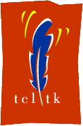
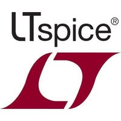
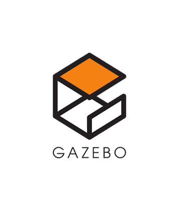

# Hallo Welt! This is [Jagadeesh](https://mummanajagadeesh.github.io/). <!-- updated: 2025-09-12 10:51:54 IST -->

<!--# こんにちは、世界！これは [Jagadeesh](https://mummanajagadeesh.github.io/) です。-->

  
  
  
  
  
  
  
  
  
  
  
  
  
  
  

<h1 align="left">
  +just_another_student;$+echo+%22future+plans%22;>+Take+AI's+Job+:P;$+ping+reality;>+Request+timed+out;$+ls+/life;>+Nothing+interesting+yet;$+cat+motivation.txt;>+motivation.txt+->+empty;$+top+-n+1;>+CPU:+99%25+brain+usage;$+git+commit+-m+%22life_changes%22;>+nothing+to+commit,+working+tree+clean;$+./run_robot.sh;>+Battery+not+included;$+sudo+rm+-rf+/stress;>+Permission+denied" 
    alt="$ whoami -> just_another_student; echo 'future plans' -> Take AI's Job :P; ping reality -> Request timed out; ls /life -> Nothing interesting yet; cat motivation.txt -> motivation.txt -> empty; top -n 1 -> CPU: 99% brain usage; git commit -m 'life_changes' -> nothing to commit, working tree clean; ./run_robot.sh -> Battery not included; sudo rm -rf /stress -> Permission denied" 
  />
</h1>

<!--    -->
  

<code>$ less ~/workspace/profile/config.yaml</code>  
<code>  FOCUS:               "Always learning — check out my <a href="https://mummanajagadeesh.github.io/blog/all"><strong>blog</strong></a>"</code> 
<code>  CURRENTLY:           "Building a HW accelerator arch for IMG CLASSIF"</code> 
<code>  CLUB:                "Rigging robots @<a href="https://mummanajagadeesh.github.io/RIGNITC"><strong>RIGNITC</strong></a>"</code> 
<code>  MAJOR:               "<em>Electronics and Communication Engg</em>"</code> 
<code>  COLLEGE:             "<em>National Institute of Technology Calicut</em>"</code> 
<code>  CONTACT:             "<a href="https://mummanajagadeesh.github.io/contact"><strong>Carrier Pigeons :P</strong></a>"</code> 
<code>  PRONOUNS:            "he/him"</code> 
<code>  HOBBIES:             ["Speedcubing", "Movies", "Blogging"]</code> 
<code>  FUNFACT:             "I'm Batman"</code> 
<code>  SECRET:              "I pay the moon to follow me around"</code> 
<code>  WHATIF:              "If I eat myself, do I become twice as big or disappear?"</code> 

<!--<code>module about_me;</code> 

<code>    parameter FOCUS     = "Always learning — check out my <a href="https://mummanajagadeesh.github.io/blog/all"><strong>blog</strong></a>",</code> 
<code>              CURRENTLY = "Building a HW accelerator arch for IMG CLASSIF",</code> 
<code>              CLUB      = "Rigging robots @<a href="https://mummanajagadeesh.github.io/RIGNITC"><strong>RIGNITC</strong></a>",</code> 
<code>              MAJOR     = "<em>Electronics and Communication Engg</em>",</code> 
<code>              COLLEGE   = "<em>National Institute of Technology Calicut</em>",</code> 
<code>              CONTACT   = "<a href="https://mummanajagadeesh.github.io/contact"><strong>Carrier Pigeons :P</strong></a>",</code> 
<code>              PRONOUNS  = "he/him",</code> 
<code>              HOBBIES   = "Speedcubing, Movies, Blogging",</code> 
<code>              FUN_FACT  = "I'm Batman";</code> 

<code>endmodule</code> -->

  <picture>
    <source srcset="dist/github-snake-dark.svg" media="(prefers-color-scheme: dark)">
    
  </picture>

  

# `$ cat ~/about_me.txt`

Hey, I'm Jagadeesh — I work across VLSI design, robotics, and AI hardware. I’m particularly interested in digital and analog VLSI, hardware acceleration for machine learning and image processing, and the practical side of taking designs from code to silicon. Alongside this, I enjoy programming embedded systems, working with microcontrollers, and building robotics applications. I also enjoy collaborating in competitions, open-source projects, and hands-on hardware/software design challenges.

MY Key Interests:

- VLSI Design: Analog Circuits & Digital Design
- Neural Networks & Image Processing in HW/SW
- Embedded Programming (C, C++, Python)
- Microcontrollers & Electronics
- Computer Vision, Sensor Fusion
- Robotics, AMR Path Planning & Navigation
  
Feel free to check out my projects [**`here`**](https://mummanajagadeesh.github.io/projects/), and if you’re interested in collaborating or discussing hardware, AI, or robotics, let’s connect!

<!--<pre>
  
Hey, I'm Jagadeesh — I work across VLSI design, robotics, and AI hardware.
I’m particularly interested in digital and analog VLSI, hardware acceleration for machine learning and image processing,
and the practical side of taking designs from code to silicon.
Alongside this, I enjoy programming embedded systems, working with microcontrollers, and building robotics applications.
I also enjoy collaborating in competitions, open-source projects, and hands-on hardware/software design challenges.

  
MY Key Interests:                                                           What I Do:
- VLSI Design: Analog & Digital                                             - I’m a student (yes, I copy assignments)  
- Neural Nets & Image Processing                                            - But serious with projects & builds 
- Embedded Programming (C, C++, Python)                                     - Do a bit of digital & analog design on the side
- Microcontrollers & Electronics                                            - Train models sometimes   
- Computer Vision, Sensor Fusion                                            - Member of RIGNITC (we make robots)
- Robotics, Path Planning & Navigation                                      - Show up at hw comps (sw depends on mood)

  
Feel free to check out my projects [here](https://mummanajagadeesh.github.io/projects/), 
and if you’re interested in collaborating or discussing hardware, AI, or robotics, let’s connect!
  
</pre>-->

  

# `$ ls ~/projects --filter=feat` | [`All Projects`](https://mummanajagadeesh.github.io/projects/)

<em>(Click sections below to expand)</em>

  <strong>
    Verilog HDL Toolkit for Image Processing and Neural Network Acceleration |
    <a href="https://mummanajagadeesh.github.io/projects/improve/subprojects" target="_blank">Link</a>
  </strong>

 
  
> **" I tried to ImProVe, but NeVer really did — so I MOVe-d on ¯\\\_(ツ)_/¯ "**

A modular hardware-accelerated toolkit built entirely in Verilog using only open-source tools, featuring image processing algorithms, fixed-point arithmetic modules, an MLP for (E)MNIST, and a sequential CNN for CIFAR-10. Designed for efficient, low-latency computation in embedded vision systems, with simulation automation and a real-time GUI interface

  

  

<strong>ViSiON</strong> – <strong><em>V</em></strong>erilog for <strong><em>I</em></strong>mage Processing and <strong><em>S</em></strong>imulation-based <strong><em>I</em></strong>nference <strong><em>O</em></strong>f <strong><em>N</em></strong>eural Networks

This repo includes all related projects as submodules in one place

  

---

<!-- Image Cards Table -->
<table>
  <tr>
    <td align="center">
      
      
    </td>
    <td align="center">
      
      
    </td>
  </tr>
</table>

<!-- Descriptions below -->
 

<strong>ImProVe</strong> – <strong><em>IM</em></strong>age <strong><em>PRO</em></strong>cessing using <strong><em>VE</em></strong>rilog: A collection of image processing algorithms implemented in Verilog, including geometric transformations, color space conversions, and other foundational operations.

<strong>NeVer</strong> – <strong><em>NE</em></strong>ural <strong><em>NE</em></strong>twork on <strong><em>VER</em></strong>ilog: A hardware-implemented MLP in Verilog for character recognition on (E)MNIST, alongside a lightweight CNN for CIFAR-10 image classification

 

<strong>MOVe</strong> – <strong><em>M</em></strong>ath <strong><em>O</em></strong>ps in <strong><em>VE</em></strong>rilog

<!-- Image Cards Table -->
<table>
  <tr>
    <td align="center">
      
      
    </td>
    <td align="center">
      
      
    </td>
  </tr>
</table>

<!-- Light Mode Repo Card -->

<!-- Dark Mode Repo Card -->

 

<!-- Descriptions as bullet points -->
 

<ul>
  <li>
    
<strong>CORDIC Algorithm</strong> – Implements Coordinate Rotation Digital Computer (CORDIC) algorithms in Verilog for efficient hardware-based calculation of sine, cosine, tangent, square root, magnitude, and more.

  </li>
  <li>
    
<strong>Systolic Array Matrix Multiplication</strong> – Verilog implementation of matrix multiplication using systolic arrays to enable parallel computation and hardware-level performance optimization. Each processing element leverages a Multiply-Accumulate (MAC) unit for core operations.

  </li>
  <li>
    
<strong>Multiply-Accumulate Unit</strong> – Uses Booth’s algorithm and a Kogge-Stone adder for efficient signed multiplication and fast parallel addition; other approaches like MBE and CSA are also being explored to boost speed.

  </li>
  <li>
    
<strong>Posit Arithmetic (Python)</strong> – Currently using fixed-point arithmetic; considering Posit as an alternative to IEEE 754 for better precision and dynamic range. Still working through the trade-off.

  </li>
</ul>

 

<strong>Storage and Buffer Modules</strong>

<ul>
  <li>
    
<strong>RAM1KB</strong> – A 1KB (1024 x 8-bit) memory module in Verilog with write-once locking for even addresses. Includes a randomized testbench. Also forms the base for a <strong>ROM3KB</strong> variant to store 32×32 RGB CIFAR-10 image data.

  <li>
    
<strong>FIFO Buffer</strong> – Not started. Planned as a synchronous FIFO with fixed depth, single clock domain, and standard full/empty flag logic.

  </li>
</ul>

 

**Current Project Overview**

**Duration:** Individual, Ongoing  
**Tools:** Verilog (Icarus Verilog, Yosys) | Python (TensorFlow, PyTorch, OpenCV, NumPy, Tkinter) | Scripting (TCL, Perl)

- **Designed `image processing algorithms` (e.g., edge detection, geometric & color transforms, noise reduction) in Verilog, utilizing `hardware optimized math` techniques to maximize computational efficiency. These algorithms were fine-tuned for `low-latency` preprocessing in embedded vision SoCs.**

- **Implemented a `64-bit 3-layer perceptron` (`MLP 784-256-128-62`, `~242k params`) for Extended-MNIST Character Recognition (`62 classes, ∼124k samples`) using an FSM-controlled neural network in Verilog. This implementation achieved `>90% training accuracy` (`>75% simulation accuracy`) with `~1.5s inference latency` (in simulation). A full end-to-end preprocessing and inference workflow was developed.**

- **Automated model `inference` and `performance metric` evaluation via Tcl/Perl scripts (executing Python and Icarus Verilog commands). Additionally, a real-time Tkinter GUI was created for test user input.**

* **Developed a `lightweight CNN [Conv2D×2 + MaxPool]×3 → GAP → Dense(10)` for `CIFAR-10 Image Classification (32x32RGB)` using both `IEEE 754` floating-point and `Q1.31`, `Q1.15`, `Q1.7`, and `Q1.3` fixed-point arithmetic, achieving 84% accuracy in both implementations _(Py \~85% | FP \~84% | Q31 \~84% | Q15 \~84% | Q7 \~83% | Q3 \~65%)_**

- **Currently working on `Object Detection` using `shallow CNNs` on the `Pascal VOC dataset`**

  

  
  <strong>  
    ANAV for Martian Surface Exploration (ISRO IRoC‑U 2025) |  
    <a href="https://mummanajagadeesh.github.io/projects/isro-anav/" target="_blank">Link</a>  
  </strong>  

  

  
<!-- Light Mode Repo Card -->

<!-- Dark Mode Repo Card -->

 

 

An autonomous aerial system designed for reliable navigation and landing in environments without GPS, using onboard visual-inertial mapping, real-time obstacle awareness, and wireless telemetry

**Duration:** Team-based (ISRO RIG), Ongoing
**Tools:** Jetson Nano | Pixhawk | RealSense D435i | ESP32 (ESP‑Now) | VINS‑Fusion | ROS2

* **Built a `<2kg autonomous quadrotor>` for `GNSS-denied environments`, capable of `real-time mapping`, `navigation`, and `safe-zone detection` with zero manual intervention; Jetson Nano was used for onboard compute and Pixhawk handled flight control.**

* **Calibrated ESCs and implemented `embedded power distribution` via BEC module to ensure stable regulation for compute/sensing; integrated barometer and external optical flow sensor with Pixhawk for redundancy in low-texture or drifting conditions.**

* **Fused stereo-IMU data from `Intel RealSense D435i` using `VINS-Fusion` on `ROS2`, achieving `<5cm drift` over \~5m; transmitted real-time telemetry using ESP32 modules (`ESP‑Now`); autonomously landed on `obstacle-free 1.5×1.5m` zones with `<15° slopes`.**

  <strong>
    RV32I RTL CPU DESIGN |
    <a href="https://mummanajagadeesh.github.io/projects/rose" target="_blank">Link</a>
  </strong>

  
  
<!-- Light Mode Repo Card -->

<!-- Dark Mode Repo Card -->

 

 

**Duration:** Individual, Ongoing  
**Tools:** Verilog (Icarus Verilog) | TL-Verilog (Makerchip) 

- **Implemented a fully synthesizable RV32I RISC-V core** in TL-Verilog with a single-stage pipeline, supporting all base integer instructions and immediate formats (I, S, B, U, J).

- **Developed a test program summing integers 1 to 9**, verified correct ALU operations, branching, and control flow within 50 simulation cycles, with pass/fail status stored in registers `x30` and `x31`.

- **Designed a 32-register file with dual-read and single-write ports**, enforcing write-disable on register `x0`, and integrated instruction decode logic handling opcode, funct3, and funct7 fields.

- **Implemented comprehensive ALU supporting arithmetic, logic, shifts, and comparisons**, with immediate extraction and flexible program counter update logic including branch and jump target calculation.

- **Enabled simulation and debugging via Makerchip integration** using `m4+cpu_viz()`, with waveform visualization and automated test validation through register monitoring.

  <strong>
    I2C & SPI Protocol FSMs in Verilog | 
        <a href="https://mummanajagadeesh.github.io/protocols/" target="_blank">Link</a>
  </strong>

  
  
<table>
  <tr>
    <td align="center">
      
      
    </td>
    <td align="center">
      
      
    </td>
  </tr>
</table>

 

 

Designed I2C with a single-master, multi-slave configuration supporting clock stretching and configurable delays; SPI supports modes 0–3 via CPOL/CPHA, performs single 8-bit full-duplex transfers, and allows clock frequency scaling through a divider

  <strong>
    Device Modeling using Sentaurus TCAD | 
        <a href="https://github.com/Mummanajagadeesh/TCAD-PROJECTS/" target="_blank">Link</a>
  </strong>

  
  
<!-- Light Mode Repo Card -->

<!-- Dark Mode Repo Card -->

 

 

Designed and simulated semiconductor structures (N-resistor, PN diode, NMOS) using Sentaurus TCAD; explored effects of doping, geometry, and physical models through process setup, simulation scripting, and visual analysis of internal device behavior

  <strong>
    RU83C – Rubik’S Cube Solving Robot |
    <a href="https://mummanajagadeesh.github.io/projects/rubec/" target="_blank">Link</a>
  </strong>

  
<!-- Light Mode Repo Card -->
<table>
  <tr>
    <td align="center">
      
      
    </td>
    <td align="center">
      
      
    </td>
  </tr>
</table>

A vision-guided, algorithm-driven robot that solves the Rubik’s Cube with precision using Kociemba’s two-phase algorithm for optimal move sequences, developed in Unity3D with C# scripting

  

# `$ env | grep STACK`

  <!-- Programming Languages -->
  
  
  
  

  <!-- Digital Design / HDL / EDA -->
  
  
  
  
  
  
  
  
  

  <!-- SPICE / Analog Simulation -->
  
  
  
  
  
  

  <!-- PCB Design -->
  

  <!-- Embedded Systems -->
  
  

  <!-- Robotics / Simulation -->
  
  
  
  
  
  
  

  <!-- Documentation / Productivity -->
  
  
  
  

  <!-- Miscellaneous -->
  
  
  
  
  
  
  
  
  
  

  

# `$ git stats --all`

  <!-- Light mode trophy -->
  

  <!-- Dark mode trophy -->
  

<!-- Light Mode -->
<a href="https://github.com/Mummanajagadeesh#gh-light-mode-only">
  

    
    
    
  

</a>

<!-- Dark Mode -->
<a href="https://github.com/Mummanajagadeesh#gh-dark-mode-only">
  

    
    
    
  

</a>

# `$ sudo wisdom`

<!-- Light Mode Quote -->

  

<!-- Dark Mode Quote -->

  

