# `$ env --familiar | grep TOOLS`

  
Tools I’m familiar with and use

   

  <!-- Programming Languages -->
  
  
  
  

  <!-- Digital Design / HDL / EDA -->
  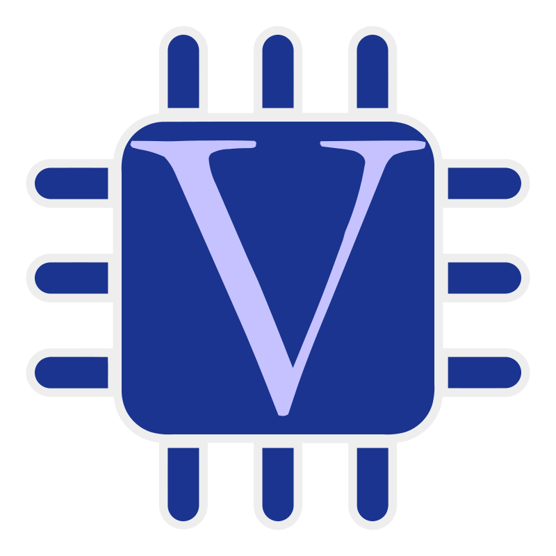
  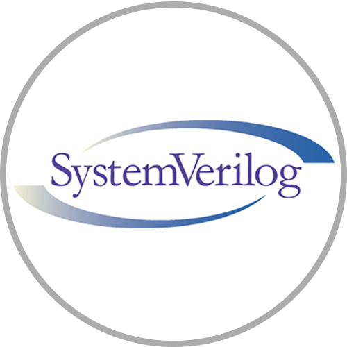
  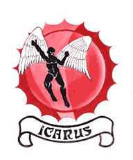
  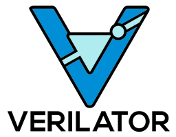
  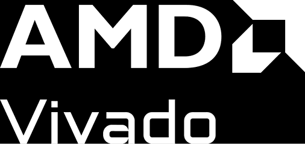
  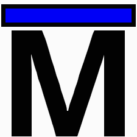
  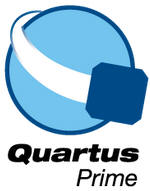
  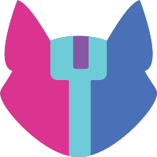
  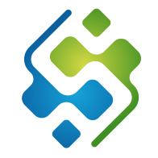
  
  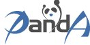
  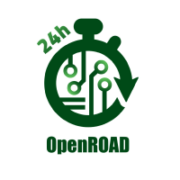
  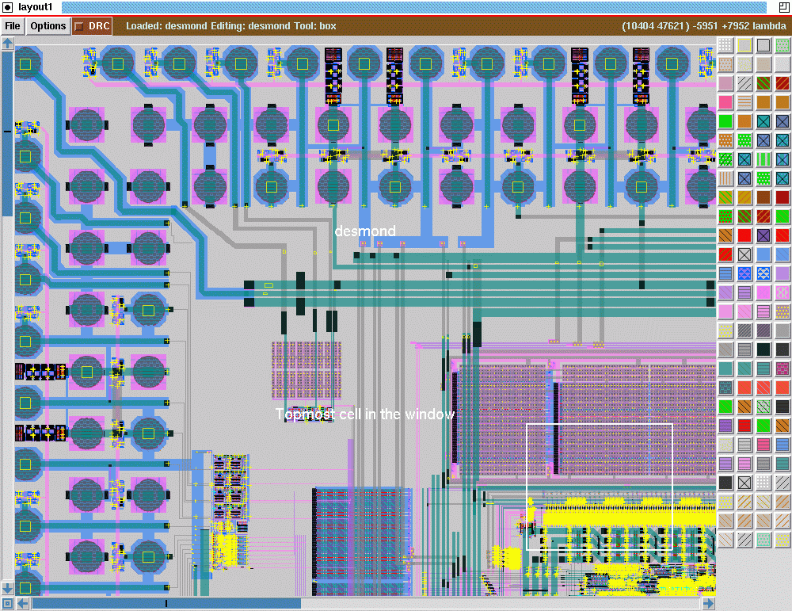
  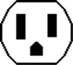
  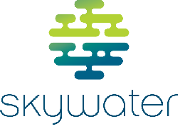
  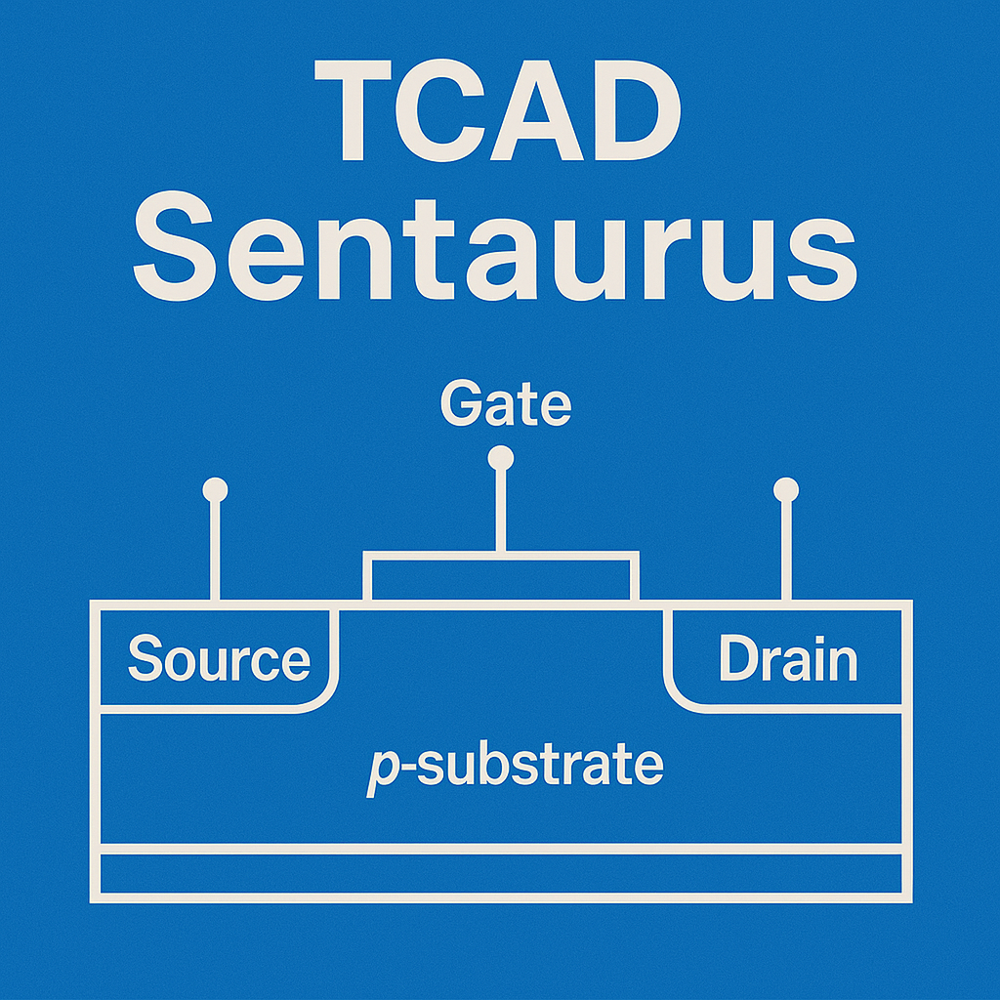
  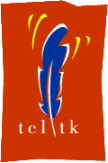
  
  

  <!-- SPICE / Analog Simulation -->
  
  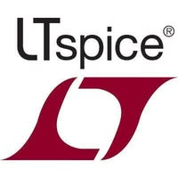
  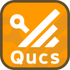
  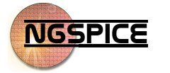
  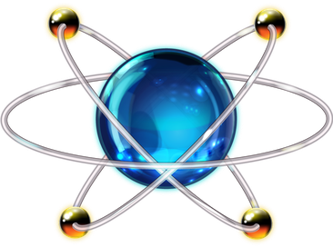
  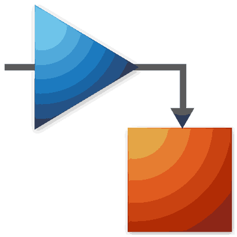
  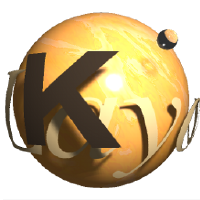

  <!-- PCB Design -->
  

  <!-- Embedded Systems -->
  
  

  <!-- Robotics / Simulation -->
  
  
  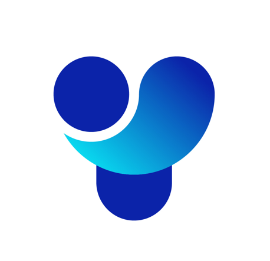
  
  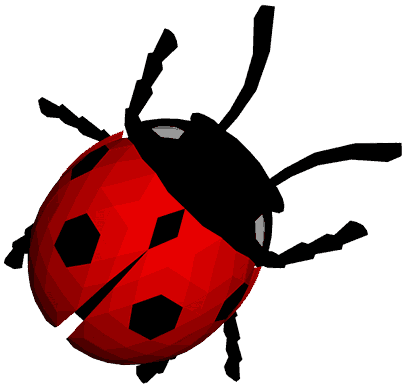
  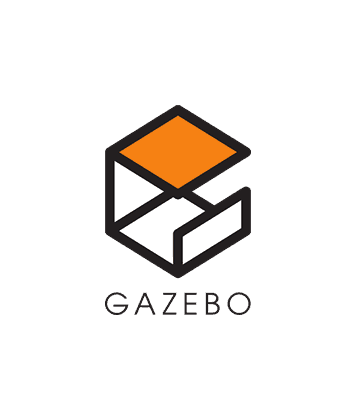
  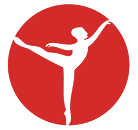
  
  

  <!-- Documentation / Productivity -->
  
  
  
  

  <!-- Miscellaneous -->
  
  
  
<!--  
  
  
  
-->
  
  
  

